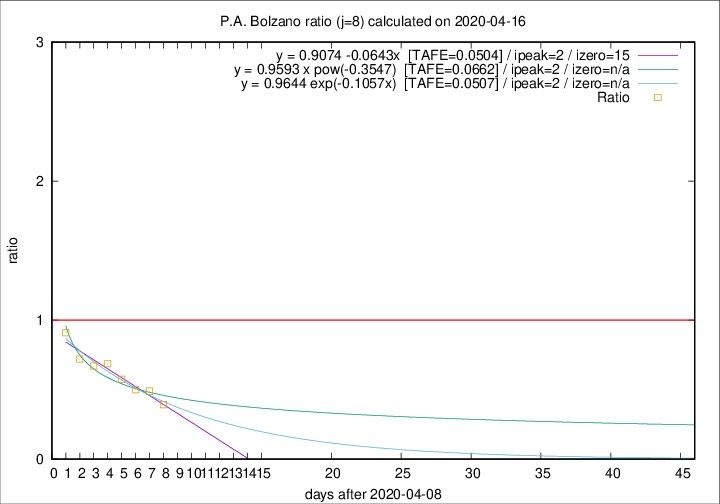

# P.A. Bolzano

Data source: https://raw.githubusercontent.com/pcm-dpc/COVID-19/master/dati-json/dpc-covid19-ita-regioni.json

Estimates in this page were made on 16/4/2020 with data available until 16/04/2020.

## Summary 

### Peak estimate 
|j|linear [TAFE]|exponential [TAFE]|power law [TAFE]|details|
|---|----|-----------|---------|-------|
|7|12/4/2020 [TAFE=0.1498]|12/4/2020 [TAFE=0.1493]|12/4/2020 [TAFE=0.1371]|[analysis](COVID-19_p.a._bolzano_j7_2020-04-16.md)|
|8|11/4/2020 [TAFE=0.0504]|11/4/2020 [TAFE=0.0507]|11/4/2020 [TAFE=0.0662]|[analysis](COVID-19_p.a._bolzano_j8_2020-04-16.md)|
|9|13/4/2020 [TAFE=0.3264]|13/4/2020 [TAFE=0.1903]|12/4/2020 [TAFE=0.1189]|[analysis](COVID-19_p.a._bolzano_j9_2020-04-16.md)|
|10|14/4/2020 [TAFE=0.2679]|13/4/2020 [TAFE=0.1819]|13/4/2020 [TAFE=0.2136]|[analysis](COVID-19_p.a._bolzano_j10_2020-04-16.md)|
|11|15/4/2020 [TAFE=0.1940]|14/4/2020 [TAFE=0.1617]|14/4/2020 [TAFE=0.2678]|[analysis](COVID-19_p.a._bolzano_j11_2020-04-16.md)|
|12|16/4/2020 [TAFE=0.1364]|15/4/2020 [TAFE=0.1520]|17/4/2020 [TAFE=0.2917]|[analysis](COVID-19_p.a._bolzano_j12_2020-04-16.md)|
|13|16/4/2020 [TAFE=0.1486]|17/4/2020 [TAFE=0.1377]|21/4/2020 [TAFE=0.2509]|[analysis](COVID-19_p.a._bolzano_j13_2020-04-16.md)|
|14|16/4/2020 [TAFE=0.1983]|18/4/2020 [TAFE=0.1180]|27/4/2020 [TAFE=0.2288]|[analysis](COVID-19_p.a._bolzano_j14_2020-04-16.md)|

Best estimator is linear with j=8 (TAFE=0.0504)
Corresponding peak date estimate is 11/4/2020 (ipeak 2)

Peak date range estimate: 11/4/2020 - 3/5/2020

### End estimate 
|j|linear [TAFE/TFE]|exponential [TAFE/TFE]|power law [TAFE/TFE]|details|
|---|----|-----------|---------|-------|
|7|25/6/2020 [TAFE=0.1498]|-|-|[analysis](COVID-19_p.a._bolzano_j7_2020-04-16.md)|
|8|24/4/2020 [TAFE=0.0504]|-|-|[analysis](COVID-19_p.a._bolzano_j8_2020-04-16.md)|
|9|-|-|-|[analysis](COVID-19_p.a._bolzano_j9_2020-04-16.md)|
|10|-|-|-|[analysis](COVID-19_p.a._bolzano_j10_2020-04-16.md)|
|11|-|-|-|[analysis](COVID-19_p.a._bolzano_j11_2020-04-16.md)|
|12|-|-|-|[analysis](COVID-19_p.a._bolzano_j12_2020-04-16.md)|
|13|-|-|-|[analysis](COVID-19_p.a._bolzano_j13_2020-04-16.md)|
|14|-|-|-|[analysis](COVID-19_p.a._bolzano_j14_2020-04-16.md)|

Best estimator is linear with j=8 (TAFE=0.0504)
Corresponding end date estimate is 24/4/2020 (izero 15)

End date range estimate: 9/4/2020 - 24/6/2020

Generated April 16th, 2020 at 20:09:19 UTC+0200 with https://github.com/robianc/COVID-19
