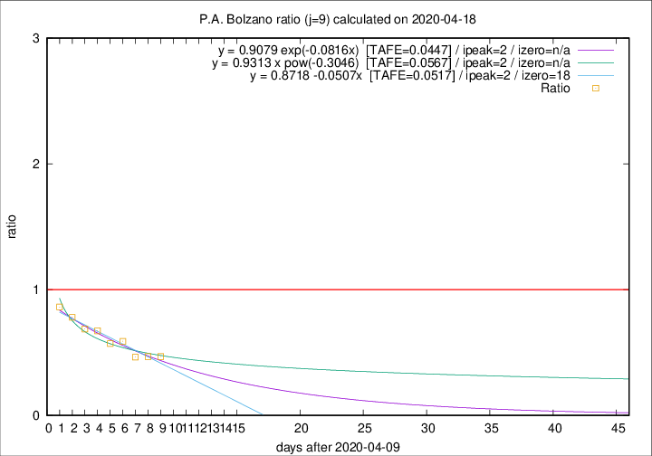

# P.A. Bolzano

Data source: https://raw.githubusercontent.com/pcm-dpc/COVID-19/master/dati-json/dpc-covid19-ita-regioni.json

Estimates in this page were made on 19/4/2020 with data available until 18/04/2020.

## Summary 

### Peak estimate 
|j|linear [TAFE]|exponential [TAFE]|power law [TAFE]|details|
|---|----|-----------|---------|-------|
|7|14/4/2020 [TAFE=0.1070]|14/4/2020 [TAFE=0.1033]|14/4/2020 [TAFE=0.1128]|[analysis](COVID-19_p.a._bolzano_j7_2020-04-18.md)|
|8|13/4/2020 [TAFE=0.1914]|13/4/2020 [TAFE=0.1867]|13/4/2020 [TAFE=0.1744]|[analysis](COVID-19_p.a._bolzano_j8_2020-04-18.md)|
|9|12/4/2020 [TAFE=0.0517]|12/4/2020 [TAFE=0.0447]|12/4/2020 [TAFE=0.0567]|[analysis](COVID-19_p.a._bolzano_j9_2020-04-18.md)|
|10|15/4/2020 [TAFE=0.3268]|14/4/2020 [TAFE=0.1923]|13/4/2020 [TAFE=0.0991]|[analysis](COVID-19_p.a._bolzano_j10_2020-04-18.md)|
|11|16/4/2020 [TAFE=0.2814]|15/4/2020 [TAFE=0.1831]|14/4/2020 [TAFE=0.1783]|[analysis](COVID-19_p.a._bolzano_j11_2020-04-18.md)|
|12|16/4/2020 [TAFE=0.2167]|16/4/2020 [TAFE=0.1558]|15/4/2020 [TAFE=0.2366]|[analysis](COVID-19_p.a._bolzano_j12_2020-04-18.md)|
|13|17/4/2020 [TAFE=0.1648]|16/4/2020 [TAFE=0.1364]|17/4/2020 [TAFE=0.2841]|[analysis](COVID-19_p.a._bolzano_j13_2020-04-18.md)|
|14|17/4/2020 [TAFE=0.1930]|18/4/2020 [TAFE=0.1248]|21/4/2020 [TAFE=0.2551]|[analysis](COVID-19_p.a._bolzano_j14_2020-04-18.md)|

Best estimator is exp with j=9 (TAFE=0.0447)
Corresponding peak date estimate is 12/4/2020 (ipeak 2)

Peak date range estimate: 12/4/2020 - 26/4/2020

### End estimate 
|j|linear [TAFE/TFE]|exponential [TAFE/TFE]|power law [TAFE/TFE]|details|
|---|----|-----------|---------|-------|
|7|-|-|-|[analysis](COVID-19_p.a._bolzano_j7_2020-04-18.md)|
|8|-|-|-|[analysis](COVID-19_p.a._bolzano_j8_2020-04-18.md)|
|9|28/4/2020 [TAFE=0.0517]|-|-|[analysis](COVID-19_p.a._bolzano_j9_2020-04-18.md)|
|10|-|-|-|[analysis](COVID-19_p.a._bolzano_j10_2020-04-18.md)|
|11|-|-|-|[analysis](COVID-19_p.a._bolzano_j11_2020-04-18.md)|
|12|-|-|-|[analysis](COVID-19_p.a._bolzano_j12_2020-04-18.md)|
|13|-|-|-|[analysis](COVID-19_p.a._bolzano_j13_2020-04-18.md)|
|14|-|-|-|[analysis](COVID-19_p.a._bolzano_j14_2020-04-18.md)|

Best estimator is linear with j=9 (TAFE=0.0517)
Corresponding end date estimate is 28/4/2020 (izero 18)

End date range estimate: 10/4/2020 - 28/4/2020

Generated April 19th, 2020 at 18:42:39 UTC+0200 with https://github.com/robianc/COVID-19
