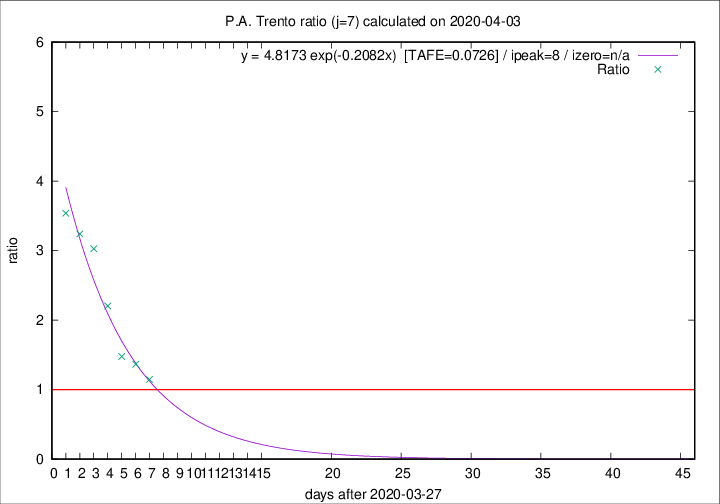

# P.A. Trento

Data source: https://raw.githubusercontent.com/pcm-dpc/COVID-19/master/dati-json/dpc-covid19-ita-regioni.json

Estimates in this page were made on 9/4/2020 with data available until 03/04/2020.

## Summary 

### Peak estimate 
|j|linear [TAFE]|exponential [TAFE]|power law [TAFE]|details|
|---|----|-----------|---------|-------|
|7|4/4/2020 [TAFE=0.0883]|5/4/2020 [TAFE=0.0726]|9/4/2020 [TAFE=0.1601]|[analysis](COVID-19_p.a._trento_j7_2020-04-03.md)|
|8|4/4/2020 [TAFE=0.2246]|6/4/2020 [TAFE=0.1342]|13/4/2020 [TAFE=0.1880]|[analysis](COVID-19_p.a._trento_j8_2020-04-03.md)|
|9|4/4/2020 [TAFE=0.2292]|7/4/2020 [TAFE=0.1213]|24/4/2020 [TAFE=0.2341]|[analysis](COVID-19_p.a._trento_j9_2020-04-03.md)|
|10|6/4/2020 [TAFE=0.1932]|11/4/2020 [TAFE=0.2218]|-|[analysis](COVID-19_p.a._trento_j10_2020-04-03.md)|
|11|5/4/2020 [TAFE=0.2412]|12/4/2020 [TAFE=0.2404]|-|[analysis](COVID-19_p.a._trento_j11_2020-04-03.md)|
|12|-|-|-||
|13|-|-|-||
|14|-|-|-||

Best estimator is exp with j=7 (TAFE=0.0726)
Corresponding peak date estimate is 5/4/2020 (ipeak 8)

Peak date range estimate: 28/3/2020 - 26/4/2020

### End estimate 
|j|linear [TAFE/TFE]|exponential [TAFE/TFE]|power law [TAFE/TFE]|details|
|---|----|-----------|---------|-------|
|7|7/4/2020 [TAFE=0.0883]|-|-|[analysis](COVID-19_p.a._trento_j7_2020-04-03.md)|
|8|-|-|-|[analysis](COVID-19_p.a._trento_j8_2020-04-03.md)|
|9|-|-|-|[analysis](COVID-19_p.a._trento_j9_2020-04-03.md)|
|10|-|-|-|[analysis](COVID-19_p.a._trento_j10_2020-04-03.md)|
|11|-|-|-|[analysis](COVID-19_p.a._trento_j11_2020-04-03.md)|
|12|-|-|-||
|13|-|-|-||
|14|-|-|-||

Best estimator is linear with j=7 (TAFE=0.0883)
Corresponding end date estimate is 7/4/2020 (izero 10)

End date range estimate: 28/3/2020 - 10/4/2020

Generated April 9th, 2020 at 16:40:48 UTC+0200 with https://github.com/robianc/COVID-19
