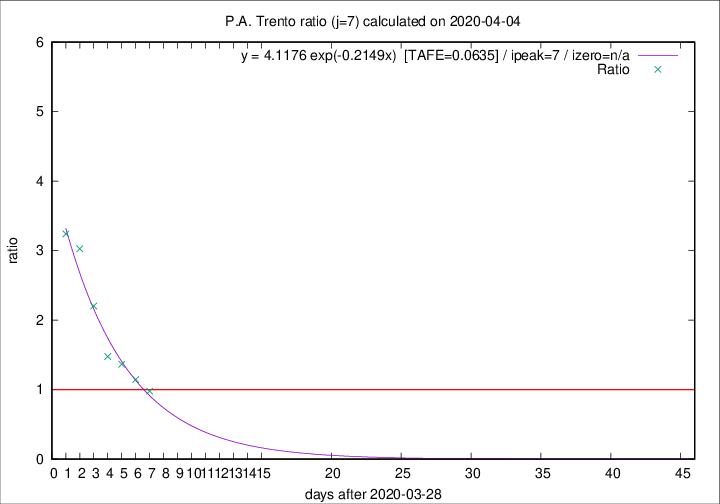

# P.A. Trento

Data source: https://raw.githubusercontent.com/pcm-dpc/COVID-19/master/dati-json/dpc-covid19-ita-regioni.json

Estimates in this page were made on 12/4/2020 with data available until 04/04/2020.

## Summary 

### Peak estimate 
|j|linear [TAFE]|exponential [TAFE]|power law [TAFE]|details|
|---|----|-----------|---------|-------|
|7|5/4/2020 [TAFE=0.1303]|5/4/2020 [TAFE=0.0635]|6/4/2020 [TAFE=0.1064]|[analysis](COVID-19_p.a._trento_j7_2020-04-04.md)|
|8|5/4/2020 [TAFE=0.3148]|6/4/2020 [TAFE=0.1372]|9/4/2020 [TAFE=0.1106]|[analysis](COVID-19_p.a._trento_j8_2020-04-04.md)|
|9|5/4/2020 [TAFE=0.3192]|7/4/2020 [TAFE=0.0918]|15/4/2020 [TAFE=0.1479]|[analysis](COVID-19_p.a._trento_j9_2020-04-04.md)|
|10|5/4/2020 [TAFE=0.2234]|9/4/2020 [TAFE=0.1586]|4/5/2020 [TAFE=0.3023]|[analysis](COVID-19_p.a._trento_j10_2020-04-04.md)|
|11|5/4/2020 [TAFE=0.3193]|11/4/2020 [TAFE=0.2248]|25/5/2020 [TAFE=0.3302]|[analysis](COVID-19_p.a._trento_j11_2020-04-04.md)|
|12|5/4/2020 [TAFE=0.3614]|12/4/2020 [TAFE=0.2057]|16/6/2020 [TAFE=0.3365]|[analysis](COVID-19_p.a._trento_j12_2020-04-04.md)|
|13|-|-|-||
|14|-|-|-||

Best estimator is exp with j=7 (TAFE=0.0635)
Corresponding peak date estimate is 5/4/2020 (ipeak 7)

Peak date range estimate: 29/3/2020 - 21/6/2020

### End estimate 
|j|linear [TAFE/TFE]|exponential [TAFE/TFE]|power law [TAFE/TFE]|details|
|---|----|-----------|---------|-------|
|7|7/4/2020 [TAFE=0.1303]|-|-|[analysis](COVID-19_p.a._trento_j7_2020-04-04.md)|
|8|-|-|-|[analysis](COVID-19_p.a._trento_j8_2020-04-04.md)|
|9|-|-|-|[analysis](COVID-19_p.a._trento_j9_2020-04-04.md)|
|10|-|-|-|[analysis](COVID-19_p.a._trento_j10_2020-04-04.md)|
|11|-|-|-|[analysis](COVID-19_p.a._trento_j11_2020-04-04.md)|
|12|-|-|-|[analysis](COVID-19_p.a._trento_j12_2020-04-04.md)|
|13|-|-|-||
|14|-|-|-||

Best estimator is linear with j=7 (TAFE=0.1303)
Corresponding end date estimate is 7/4/2020 (izero 9)

End date range estimate: 29/3/2020 - 10/4/2020

Generated April 12th, 2020 at 16:28:18 UTC+0200 with https://github.com/robianc/COVID-19
