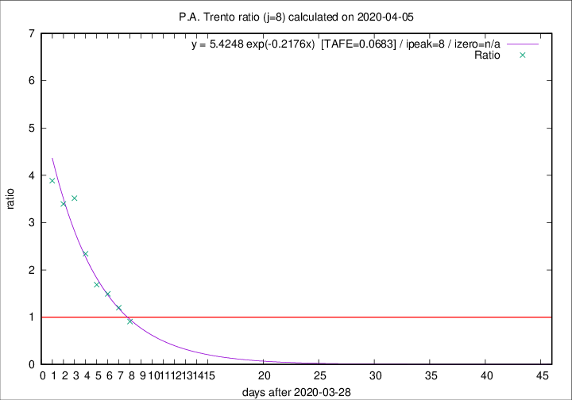

# P.A. Trento

Data source: https://raw.githubusercontent.com/pcm-dpc/COVID-19/master/dati-json/dpc-covid19-ita-regioni.json

Estimates in this page were made on 19/4/2020 with data available until 05/04/2020.

## Summary 

### Peak estimate 
|j|linear [TAFE]|exponential [TAFE]|power law [TAFE]|details|
|---|----|-----------|---------|-------|
|7|5/4/2020 [TAFE=0.1585]|5/4/2020 [TAFE=0.0892]|6/4/2020 [TAFE=0.0392]|[analysis](COVID-19_p.a._trento_j7_2020-04-05.md)|
|8|6/4/2020 [TAFE=0.1039]|6/4/2020 [TAFE=0.0683]|9/4/2020 [TAFE=0.1661]|[analysis](COVID-19_p.a._trento_j8_2020-04-05.md)|
|9|6/4/2020 [TAFE=0.2968]|7/4/2020 [TAFE=0.0761]|12/4/2020 [TAFE=0.1766]|[analysis](COVID-19_p.a._trento_j9_2020-04-05.md)|
|10|6/4/2020 [TAFE=0.3320]|8/4/2020 [TAFE=0.1203]|20/4/2020 [TAFE=0.2613]|[analysis](COVID-19_p.a._trento_j10_2020-04-05.md)|
|11|7/4/2020 [TAFE=0.2133]|11/4/2020 [TAFE=0.2218]|22/5/2020 [TAFE=0.4030]|[analysis](COVID-19_p.a._trento_j11_2020-04-05.md)|
|12|6/4/2020 [TAFE=0.3409]|12/4/2020 [TAFE=0.2078]|30/5/2020 [TAFE=0.3853]|[analysis](COVID-19_p.a._trento_j12_2020-04-05.md)|
|13|-|-|-||
|14|-|-|-||

Best estimator is pow with j=7 (TAFE=0.0392)
Corresponding peak date estimate is 6/4/2020 (ipeak 7)

Peak date range estimate: 30/3/2020 - 4/6/2020

### End estimate 
|j|linear [TAFE/TFE]|exponential [TAFE/TFE]|power law [TAFE/TFE]|details|
|---|----|-----------|---------|-------|
|7|8/4/2020 [TAFE=0.1585]|-|-|[analysis](COVID-19_p.a._trento_j7_2020-04-05.md)|
|8|8/4/2020 [TAFE=0.1039]|-|-|[analysis](COVID-19_p.a._trento_j8_2020-04-05.md)|
|9|-|-|-|[analysis](COVID-19_p.a._trento_j9_2020-04-05.md)|
|10|-|-|-|[analysis](COVID-19_p.a._trento_j10_2020-04-05.md)|
|11|-|-|-|[analysis](COVID-19_p.a._trento_j11_2020-04-05.md)|
|12|-|-|-|[analysis](COVID-19_p.a._trento_j12_2020-04-05.md)|
|13|-|-|-||
|14|-|-|-||

Best estimator is linear with j=8 (TAFE=0.1039)
Corresponding end date estimate is 8/4/2020 (izero 10)

End date range estimate: 29/3/2020 - 10/4/2020

Generated April 19th, 2020 at 18:42:39 UTC+0200 with https://github.com/robianc/COVID-19
