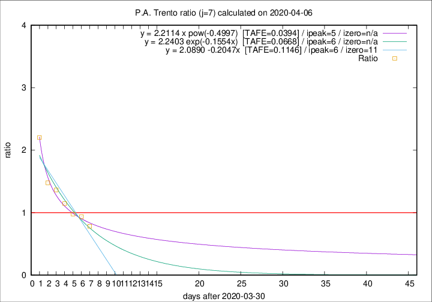

# P.A. Trento

Data source: https://raw.githubusercontent.com/pcm-dpc/COVID-19/master/dati-json/dpc-covid19-ita-regioni.json

Delta days analysis (j): 7

Analyses for other values of j for 2020-04-06 are avalable [here](../2020-04-06/README.md)

Analyses for P.A. Trento for previous dates are avalable [here](../README.md)

## Fitting 
|fit type|best fit equation|tafe|tfe|ipeak|izero|
|-------|-----|--------|------|---|---|
|linear|y = 2.0890 -0.2047x  [TAFE=0.1146]|0.1146|0.0039|6|11|
|exp|y = 2.2403 exp(-0.1554x)  [TAFE=0.0668]|0.0668|0.0028|6|n/a|
|pow|y = 2.2114 x pow(-0.4997)  [TAFE=0.0394]|0.0394|0.0010|5|n/a|

## Data
|Date|Daily deaths|Cumulated deaths|Deaths in the last 7 days|Deaths in the 7 days before|ratio|
|----|----------|-----------|-------|--------------------|-----|
|2020-04-06|13|230|83|106|0.7830|
|2020-04-05|7|217|88|94|0.9362|
|2020-04-04|6|210|90|92|0.9783|
|2020-04-03|17|204|102|89|1.1461|
|2020-04-02|14|187|101|74|1.3649|
|2020-04-01|9|173|99|67|1.4776|
|2020-03-31|17|164|108|49|2.2041|

[Download data as CSV](COVID-19_p.a._trento_j7_2020-04-06.csv)

Generated April 16th, 2020 at 20:09:19 UTC+0200 with https://github.com/robianc/COVID-19
