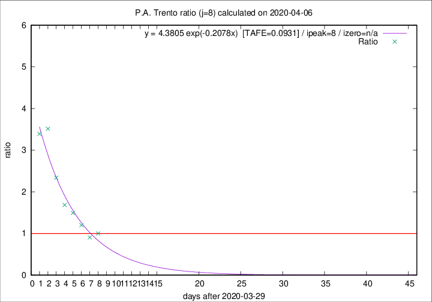

# P.A. Trento

Data source: https://raw.githubusercontent.com/pcm-dpc/COVID-19/master/dati-json/dpc-covid19-ita-regioni.json

Delta days analysis (j): 8

Analyses for other values of j for 2020-04-06 are avalable [here](../2020-04-06/README.md)

Analyses for P.A. Trento for previous dates are avalable [here](../README.md)

## Fitting 
|fit type|best fit equation|tafe|tfe|ipeak|izero|
|-------|-----|--------|------|---|---|
|exp|y = 4.3805 exp(-0.2078x)  [TAFE=0.0931]|0.0931|0.0065|8|n/a|

## Data
|Date|Daily deaths|Cumulated deaths|Deaths in the last 8 days|Deaths in the 8 days before|ratio|
|----|----------|-----------|-------|--------------------|-----|
|2020-04-06|13|230|101|101|1.0000|
|2020-04-05|7|217|97|107|0.9065|
|2020-04-04|6|210|108|90|1.2000|
|2020-04-03|17|204|118|79|1.4937|
|2020-04-02|14|187|113|67|1.6866|
|2020-04-01|9|173|117|50|2.3400|
|2020-03-31|17|164|123|35|3.5143|
|2020-03-30|18|147|112|33|3.3939|

[Download data as CSV](COVID-19_p.a._trento_j8_2020-04-06.csv)

Generated April 19th, 2020 at 18:42:39 UTC+0200 with https://github.com/robianc/COVID-19
