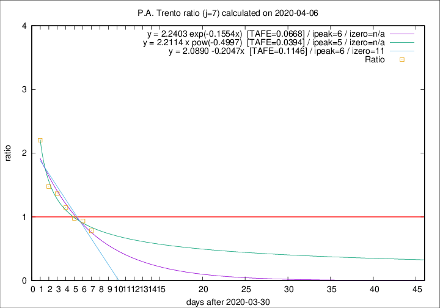

# P.A. Trento

Data source: https://raw.githubusercontent.com/pcm-dpc/COVID-19/master/dati-json/dpc-covid19-ita-regioni.json

Estimates in this page were made on 14/4/2020 with data available until 06/04/2020.

## Summary 

### Peak estimate 
|j|linear [TAFE]|exponential [TAFE]|power law [TAFE]|details|
|---|----|-----------|---------|-------|
|7|6/4/2020 [TAFE=0.1146]|6/4/2020 [TAFE=0.0668]|5/4/2020 [TAFE=0.0394]|[analysis](COVID-19_p.a._trento_j7_2020-04-06.md)|
|8|6/4/2020 [TAFE=0.1650]|7/4/2020 [TAFE=0.0931]|8/4/2020 [TAFE=0.1265]|[analysis](COVID-19_p.a._trento_j8_2020-04-06.md)|
|9|6/4/2020 [TAFE=0.3050]|7/4/2020 [TAFE=0.0782]|10/4/2020 [TAFE=0.1306]|[analysis](COVID-19_p.a._trento_j9_2020-04-06.md)|
|10|6/4/2020 [TAFE=0.4498]|8/4/2020 [TAFE=0.1091]|14/4/2020 [TAFE=0.1697]|[analysis](COVID-19_p.a._trento_j10_2020-04-06.md)|
|11|7/4/2020 [TAFE=0.3163]|10/4/2020 [TAFE=0.1497]|26/4/2020 [TAFE=0.3199]|[analysis](COVID-19_p.a._trento_j11_2020-04-06.md)|
|12|7/4/2020 [TAFE=0.4072]|11/4/2020 [TAFE=0.1966]|10/5/2020 [TAFE=0.3559]|[analysis](COVID-19_p.a._trento_j12_2020-04-06.md)|
|13|6/4/2020 [TAFE=0.5583]|13/4/2020 [TAFE=0.2022]|23/5/2020 [TAFE=0.3661]|[analysis](COVID-19_p.a._trento_j13_2020-04-06.md)|
|14|-|-|-||

Best estimator is pow with j=7 (TAFE=0.0394)
Corresponding peak date estimate is 5/4/2020 (ipeak 5)

Peak date range estimate: 31/3/2020 - 29/5/2020

### End estimate 
|j|linear [TAFE/TFE]|exponential [TAFE/TFE]|power law [TAFE/TFE]|details|
|---|----|-----------|---------|-------|
|7|11/4/2020 [TAFE=0.1146]|-|-|[analysis](COVID-19_p.a._trento_j7_2020-04-06.md)|
|8|-|-|-|[analysis](COVID-19_p.a._trento_j8_2020-04-06.md)|
|9|-|-|-|[analysis](COVID-19_p.a._trento_j9_2020-04-06.md)|
|10|-|-|-|[analysis](COVID-19_p.a._trento_j10_2020-04-06.md)|
|11|-|-|-|[analysis](COVID-19_p.a._trento_j11_2020-04-06.md)|
|12|-|-|-|[analysis](COVID-19_p.a._trento_j12_2020-04-06.md)|
|13|-|-|-|[analysis](COVID-19_p.a._trento_j13_2020-04-06.md)|
|14|-|-|-||

Best estimator is linear with j=7 (TAFE=0.1146)
Corresponding end date estimate is 11/4/2020 (izero 11)

End date range estimate: 31/3/2020 - 12/4/2020

Generated April 14th, 2020 at 19:16:04 UTC+0200 with https://github.com/robianc/COVID-19
