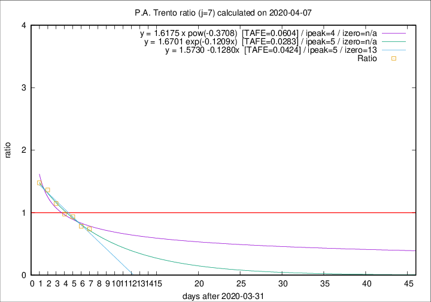

# P.A. Trento

Data source: https://raw.githubusercontent.com/pcm-dpc/COVID-19/master/dati-json/dpc-covid19-ita-regioni.json

Estimates in this page were made on 14/4/2020 with data available until 07/04/2020.

## Summary 

### Peak estimate 
|j|linear [TAFE]|exponential [TAFE]|power law [TAFE]|details|
|---|----|-----------|---------|-------|
|7|6/4/2020 [TAFE=0.0424]|6/4/2020 [TAFE=0.0283]|5/4/2020 [TAFE=0.0604]|[analysis](COVID-19_p.a._trento_j7_2020-04-07.md)|
|8|7/4/2020 [TAFE=0.2304]|7/4/2020 [TAFE=0.1192]|7/4/2020 [TAFE=0.0473]|[analysis](COVID-19_p.a._trento_j8_2020-04-07.md)|
|9|7/4/2020 [TAFE=0.1512]|8/4/2020 [TAFE=0.0675]|10/4/2020 [TAFE=0.1626]|[analysis](COVID-19_p.a._trento_j9_2020-04-07.md)|
|10|7/4/2020 [TAFE=0.3846]|9/4/2020 [TAFE=0.0905]|13/4/2020 [TAFE=0.1855]|[analysis](COVID-19_p.a._trento_j10_2020-04-07.md)|
|11|7/4/2020 [TAFE=0.4578]|10/4/2020 [TAFE=0.1276]|18/4/2020 [TAFE=0.2706]|[analysis](COVID-19_p.a._trento_j11_2020-04-07.md)|
|12|8/4/2020 [TAFE=0.2979]|11/4/2020 [TAFE=0.1845]|7/5/2020 [TAFE=0.4000]|[analysis](COVID-19_p.a._trento_j12_2020-04-07.md)|
|13|7/4/2020 [TAFE=0.4962]|13/4/2020 [TAFE=0.1967]|15/5/2020 [TAFE=0.4083]|[analysis](COVID-19_p.a._trento_j13_2020-04-07.md)|
|14|-|-|-||

Best estimator is exp with j=7 (TAFE=0.0283)
Corresponding peak date estimate is 6/4/2020 (ipeak 5)

Peak date range estimate: 1/4/2020 - 21/5/2020

### End estimate 
|j|linear [TAFE/TFE]|exponential [TAFE/TFE]|power law [TAFE/TFE]|details|
|---|----|-----------|---------|-------|
|7|14/4/2020 [TAFE=0.0424]|-|-|[analysis](COVID-19_p.a._trento_j7_2020-04-07.md)|
|8|-|-|-|[analysis](COVID-19_p.a._trento_j8_2020-04-07.md)|
|9|-|-|-|[analysis](COVID-19_p.a._trento_j9_2020-04-07.md)|
|10|-|-|-|[analysis](COVID-19_p.a._trento_j10_2020-04-07.md)|
|11|-|-|-|[analysis](COVID-19_p.a._trento_j11_2020-04-07.md)|
|12|-|-|-|[analysis](COVID-19_p.a._trento_j12_2020-04-07.md)|
|13|-|-|-|[analysis](COVID-19_p.a._trento_j13_2020-04-07.md)|
|14|-|-|-||

Best estimator is linear with j=7 (TAFE=0.0424)
Corresponding end date estimate is 14/4/2020 (izero 13)

End date range estimate: 1/4/2020 - 14/4/2020

Generated April 14th, 2020 at 19:16:04 UTC+0200 with https://github.com/robianc/COVID-19
