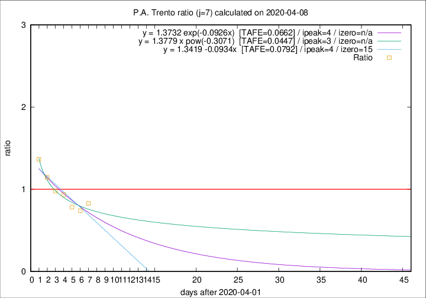

# P.A. Trento

Data source: https://raw.githubusercontent.com/pcm-dpc/COVID-19/master/dati-json/dpc-covid19-ita-regioni.json

Delta days analysis (j): 7

Analyses for other values of j for 2020-04-08 are avalable [here](../2020-04-08/README.md)

Analyses for P.A. Trento for previous dates are avalable [here](../README.md)

## Fitting 
|fit type|best fit equation|tafe|tfe|ipeak|izero|
|-------|-----|--------|------|---|---|
|linear|y = 1.3419 -0.0934x  [TAFE=0.0792]|0.0792|0.0065|4|15|
|exp|y = 1.3732 exp(-0.0926x)  [TAFE=0.0662]|0.0662|0.0033|4|n/a|
|pow|y = 1.3779 x pow(-0.3071)  [TAFE=0.0447]|0.0447|0.0014|3|n/a|

## Data
|Date|Daily deaths|Cumulated deaths|Deaths in the last 7 days|Deaths in the 7 days before|ratio|
|----|----------|-----------|-------|--------------------|-----|
|2020-04-08|11|255|82|99|0.8283|
|2020-04-07|14|244|80|108|0.7407|
|2020-04-06|13|230|83|106|0.7830|
|2020-04-05|7|217|88|94|0.9362|
|2020-04-04|6|210|90|92|0.9783|
|2020-04-03|17|204|102|89|1.1461|
|2020-04-02|14|187|101|74|1.3649|

[Download data as CSV](COVID-19_p.a._trento_j7_2020-04-08.csv)

Generated April 16th, 2020 at 20:09:19 UTC+0200 with https://github.com/robianc/COVID-19
