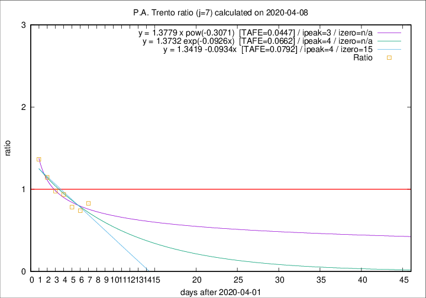

# P.A. Trento

Data source: https://raw.githubusercontent.com/pcm-dpc/COVID-19/master/dati-json/dpc-covid19-ita-regioni.json

Estimates in this page were made on 12/4/2020 with data available until 08/04/2020.

## Summary 

### Peak estimate 
|j|linear [TAFE]|exponential [TAFE]|power law [TAFE]|details|
|---|----|-----------|---------|-------|
|7|6/4/2020 [TAFE=0.0792]|6/4/2020 [TAFE=0.0662]|5/4/2020 [TAFE=0.0447]|[analysis](COVID-19_p.a._trento_j7_2020-04-08.md)|
|8|7/4/2020 [TAFE=0.1360]|7/4/2020 [TAFE=0.0792]|7/4/2020 [TAFE=0.0592]|[analysis](COVID-19_p.a._trento_j8_2020-04-08.md)|
|9|8/4/2020 [TAFE=0.2096]|8/4/2020 [TAFE=0.0905]|9/4/2020 [TAFE=0.1114]|[analysis](COVID-19_p.a._trento_j9_2020-04-08.md)|
|10|8/4/2020 [TAFE=0.3927]|9/4/2020 [TAFE=0.1131]|11/4/2020 [TAFE=0.1088]|[analysis](COVID-19_p.a._trento_j10_2020-04-08.md)|
|11|8/4/2020 [TAFE=0.5885]|10/4/2020 [TAFE=0.1257]|14/4/2020 [TAFE=0.1795]|[analysis](COVID-19_p.a._trento_j11_2020-04-08.md)|
|12|8/4/2020 [TAFE=0.4409]|11/4/2020 [TAFE=0.1367]|23/4/2020 [TAFE=0.3330]|[analysis](COVID-19_p.a._trento_j12_2020-04-08.md)|
|13|8/4/2020 [TAFE=0.5789]|12/4/2020 [TAFE=0.1782]|3/5/2020 [TAFE=0.3559]|[analysis](COVID-19_p.a._trento_j13_2020-04-08.md)|
|14|8/4/2020 [TAFE=0.8385]|13/4/2020 [TAFE=0.1936]|13/5/2020 [TAFE=0.4046]|[analysis](COVID-19_p.a._trento_j14_2020-04-08.md)|

Best estimator is pow with j=7 (TAFE=0.0447)
Corresponding peak date estimate is 5/4/2020 (ipeak 3)

Peak date range estimate: 5/4/2020 - 20/5/2020

### End estimate 
|j|linear [TAFE/TFE]|exponential [TAFE/TFE]|power law [TAFE/TFE]|details|
|---|----|-----------|---------|-------|
|7|17/4/2020 [TAFE=0.0792]|-|-|[analysis](COVID-19_p.a._trento_j7_2020-04-08.md)|
|8|-|-|-|[analysis](COVID-19_p.a._trento_j8_2020-04-08.md)|
|9|-|-|-|[analysis](COVID-19_p.a._trento_j9_2020-04-08.md)|
|10|-|-|-|[analysis](COVID-19_p.a._trento_j10_2020-04-08.md)|
|11|-|-|-|[analysis](COVID-19_p.a._trento_j11_2020-04-08.md)|
|12|-|-|-|[analysis](COVID-19_p.a._trento_j12_2020-04-08.md)|
|13|-|-|-|[analysis](COVID-19_p.a._trento_j13_2020-04-08.md)|
|14|-|-|-|[analysis](COVID-19_p.a._trento_j14_2020-04-08.md)|

Best estimator is linear with j=7 (TAFE=0.0792)
Corresponding end date estimate is 17/4/2020 (izero 15)

End date range estimate: 2/4/2020 - 17/4/2020

Generated April 12th, 2020 at 17:02:01 UTC+0200 with https://github.com/robianc/COVID-19
