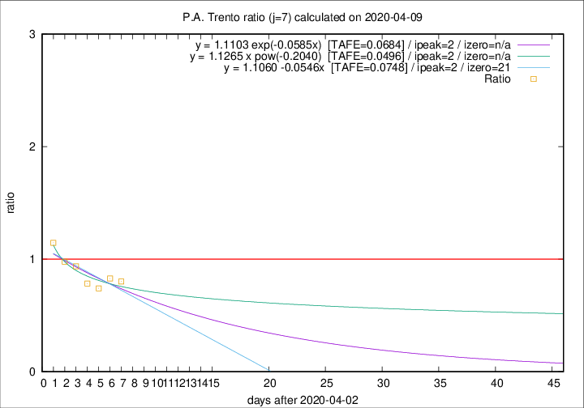

# P.A. Trento

Data source: https://raw.githubusercontent.com/pcm-dpc/COVID-19/master/dati-json/dpc-covid19-ita-regioni.json

Estimates in this page were made on 9/4/2020 with data available until 09/04/2020.

## Summary 

### Peak estimate 
|j|linear [TAFE]|exponential [TAFE]|power law [TAFE]|details|
|---|----|-----------|---------|-------|
|7|5/4/2020 [TAFE=0.0748]|5/4/2020 [TAFE=0.0684]|5/4/2020 [TAFE=0.0496]|[analysis](COVID-19_p.a._trento_j7_2020-04-09.md)|
|8|8/4/2020 [TAFE=0.0988]|7/4/2020 [TAFE=0.0790]|7/4/2020 [TAFE=0.0683]|[analysis](COVID-19_p.a._trento_j8_2020-04-09.md)|
|9|9/4/2020 [TAFE=0.2121]|8/4/2020 [TAFE=0.1029]|8/4/2020 [TAFE=0.0575]|[analysis](COVID-19_p.a._trento_j9_2020-04-09.md)|
|10|9/4/2020 [TAFE=0.2171]|9/4/2020 [TAFE=0.0742]|11/4/2020 [TAFE=0.1433]|[analysis](COVID-19_p.a._trento_j10_2020-04-09.md)|
|11|9/4/2020 [TAFE=0.5098]|10/4/2020 [TAFE=0.1257]|14/4/2020 [TAFE=0.1681]|[analysis](COVID-19_p.a._trento_j11_2020-04-09.md)|
|12|9/4/2020 [TAFE=0.6119]|11/4/2020 [TAFE=0.1311]|18/4/2020 [TAFE=0.2817]|[analysis](COVID-19_p.a._trento_j12_2020-04-09.md)|
|13|9/4/2020 [TAFE=0.4249]|13/4/2020 [TAFE=0.1663]|1/5/2020 [TAFE=0.4121]|[analysis](COVID-19_p.a._trento_j13_2020-04-09.md)|
|14|9/4/2020 [TAFE=0.7199]|14/4/2020 [TAFE=0.1854]|8/5/2020 [TAFE=0.4198]|[analysis](COVID-19_p.a._trento_j14_2020-04-09.md)|

Best estimator is pow with j=7 (TAFE=0.0496)
Corresponding peak date estimate is 5/4/2020 (ipeak 2)

Peak date range estimate: 5/4/2020 - 15/5/2020

### End estimate 
|j|linear [TAFE/TFE]|exponential [TAFE/TFE]|power law [TAFE/TFE]|details|
|---|----|-----------|---------|-------|
|7|24/4/2020 [TAFE=0.0748]|-|-|[analysis](COVID-19_p.a._trento_j7_2020-04-09.md)|
|8|-|-|-|[analysis](COVID-19_p.a._trento_j8_2020-04-09.md)|
|9|-|-|-|[analysis](COVID-19_p.a._trento_j9_2020-04-09.md)|
|10|-|-|-|[analysis](COVID-19_p.a._trento_j10_2020-04-09.md)|
|11|-|-|-|[analysis](COVID-19_p.a._trento_j11_2020-04-09.md)|
|12|-|-|-|[analysis](COVID-19_p.a._trento_j12_2020-04-09.md)|
|13|-|-|-|[analysis](COVID-19_p.a._trento_j13_2020-04-09.md)|
|14|-|-|-|[analysis](COVID-19_p.a._trento_j14_2020-04-09.md)|

Best estimator is linear with j=7 (TAFE=0.0748)
Corresponding end date estimate is 24/4/2020 (izero 21)

End date range estimate: 3/4/2020 - 24/4/2020

Generated April 9th, 2020 at 16:40:48 UTC+0200 with https://github.com/robianc/COVID-19
