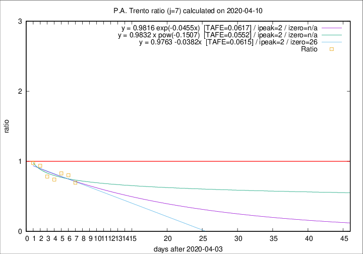

# P.A. Trento

Data source: https://raw.githubusercontent.com/pcm-dpc/COVID-19/master/dati-json/dpc-covid19-ita-regioni.json

Delta days analysis (j): 7

Analyses for other values of j for 2020-04-10 are avalable [here](../README.md)

Analyses for P.A. Trento for previous dates are avalable [here](../../README.md)

## Fitting 
|fit type|best fit equation|tafe|tfe|ipeak|izero|
|-------|-----|--------|------|---|---|
|linear|y = 0.9763 -0.0382x  [TAFE=0.0615]|0.0615|0.0044|2|26|
|exp|y = 0.9816 exp(-0.0455x)  [TAFE=0.0617]|0.0617|0.0022|2|n/a|
|pow|y = 0.9832 x pow(-0.1507)  [TAFE=0.0552]|0.0552|0.0019|2|n/a|

## Data
|Date|Daily deaths|Cumulated deaths|Deaths in the last 7 days|Deaths in the 7 days before|ratio|
|----|----------|-----------|-------|--------------------|-----|
|2020-04-10|7|275|71|102|0.6961|
|2020-04-09|13|268|81|101|0.8020|
|2020-04-08|11|255|82|99|0.8283|
|2020-04-07|14|244|80|108|0.7407|
|2020-04-06|13|230|83|106|0.7830|
|2020-04-05|7|217|88|94|0.9362|
|2020-04-04|6|210|90|92|0.9783|

[Download data as CSV](COVID-19_p.a._trento_j7_2020-04-10.csv)

Generated April 10th, 2020 at 17:26:10 UTC+0200 with https://github.com/robianc/COVID-19
