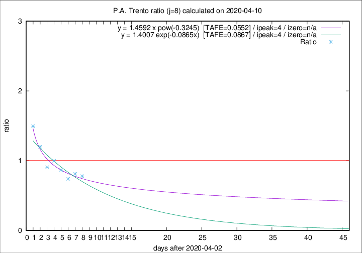

# P.A. Trento

Data source: https://raw.githubusercontent.com/pcm-dpc/COVID-19/master/dati-json/dpc-covid19-ita-regioni.json

Delta days analysis (j): 8

Analyses for other values of j for 2020-04-10 are avalable [here](../2020-04-10/README.md)

Analyses for P.A. Trento for previous dates are avalable [here](../README.md)

## Fitting 
|fit type|best fit equation|tafe|tfe|ipeak|izero|
|-------|-----|--------|------|---|---|
|exp|y = 1.4007 exp(-0.0865x)  [TAFE=0.0867]|0.0867|0.0054|4|n/a|
|pow|y = 1.4592 x pow(-0.3245)  [TAFE=0.0552]|0.0552|0.0022|4|n/a|

## Data
|Date|Daily deaths|Cumulated deaths|Deaths in the last 8 days|Deaths in the 8 days before|ratio|
|----|----------|-----------|-------|--------------------|-----|
|2020-04-10|7|275|88|113|0.7788|
|2020-04-09|13|268|95|117|0.8120|
|2020-04-08|11|255|91|123|0.7398|
|2020-04-07|14|244|97|112|0.8661|
|2020-04-06|13|230|101|101|1.0000|
|2020-04-05|7|217|97|107|0.9065|
|2020-04-04|6|210|108|90|1.2000|
|2020-04-03|17|204|118|79|1.4937|

[Download data as CSV](COVID-19_p.a._trento_j8_2020-04-10.csv)

Generated April 16th, 2020 at 20:09:19 UTC+0200 with https://github.com/robianc/COVID-19
