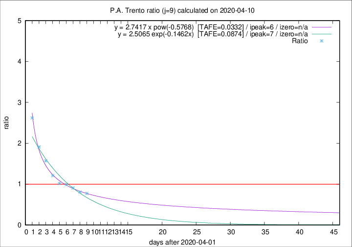

# P.A. Trento

Data source: https://raw.githubusercontent.com/pcm-dpc/COVID-19/master/dati-json/dpc-covid19-ita-regioni.json

Estimates in this page were made on 14/4/2020 with data available until 10/04/2020.

## Summary 

### Peak estimate 
|j|linear [TAFE]|exponential [TAFE]|power law [TAFE]|details|
|---|----|-----------|---------|-------|
|7|6/4/2020 [TAFE=0.0615]|6/4/2020 [TAFE=0.0617]|6/4/2020 [TAFE=0.0552]|[analysis](COVID-19_p.a._trento_j7_2020-04-10.md)|
|8|8/4/2020 [TAFE=0.1024]|7/4/2020 [TAFE=0.0867]|7/4/2020 [TAFE=0.0552]|[analysis](COVID-19_p.a._trento_j8_2020-04-10.md)|
|9|9/4/2020 [TAFE=0.1605]|9/4/2020 [TAFE=0.0874]|8/4/2020 [TAFE=0.0332]|[analysis](COVID-19_p.a._trento_j9_2020-04-10.md)|
|10|10/4/2020 [TAFE=0.2368]|10/4/2020 [TAFE=0.0909]|10/4/2020 [TAFE=0.1076]|[analysis](COVID-19_p.a._trento_j10_2020-04-10.md)|
|11|10/4/2020 [TAFE=0.4896]|10/4/2020 [TAFE=0.1367]|12/4/2020 [TAFE=0.1008]|[analysis](COVID-19_p.a._trento_j11_2020-04-10.md)|
|12|9/4/2020 [TAFE=0.7270]|11/4/2020 [TAFE=0.1450]|15/4/2020 [TAFE=0.1623]|[analysis](COVID-19_p.a._trento_j12_2020-04-10.md)|
|13|10/4/2020 [TAFE=0.6247]|12/4/2020 [TAFE=0.1356]|22/4/2020 [TAFE=0.3450]|[analysis](COVID-19_p.a._trento_j13_2020-04-10.md)|
|14|9/4/2020 [TAFE=0.8040]|13/4/2020 [TAFE=0.1782]|30/4/2020 [TAFE=0.3661]|[analysis](COVID-19_p.a._trento_j14_2020-04-10.md)|

Best estimator is pow with j=9 (TAFE=0.0332)
Corresponding peak date estimate is 8/4/2020 (ipeak 6)

Peak date range estimate: 4/4/2020 - 5/5/2020

### End estimate 
|j|linear [TAFE/TFE]|exponential [TAFE/TFE]|power law [TAFE/TFE]|details|
|---|----|-----------|---------|-------|
|7|30/4/2020 [TAFE=0.0615]|-|-|[analysis](COVID-19_p.a._trento_j7_2020-04-10.md)|
|8|-|-|-|[analysis](COVID-19_p.a._trento_j8_2020-04-10.md)|
|9|-|-|-|[analysis](COVID-19_p.a._trento_j9_2020-04-10.md)|
|10|-|-|-|[analysis](COVID-19_p.a._trento_j10_2020-04-10.md)|
|11|-|-|-|[analysis](COVID-19_p.a._trento_j11_2020-04-10.md)|
|12|-|-|-|[analysis](COVID-19_p.a._trento_j12_2020-04-10.md)|
|13|-|-|-|[analysis](COVID-19_p.a._trento_j13_2020-04-10.md)|
|14|-|-|-|[analysis](COVID-19_p.a._trento_j14_2020-04-10.md)|

Best estimator is linear with j=7 (TAFE=0.0615)
Corresponding end date estimate is 30/4/2020 (izero 26)

End date range estimate: 4/4/2020 - 30/4/2020

Generated April 14th, 2020 at 19:16:04 UTC+0200 with https://github.com/robianc/COVID-19
