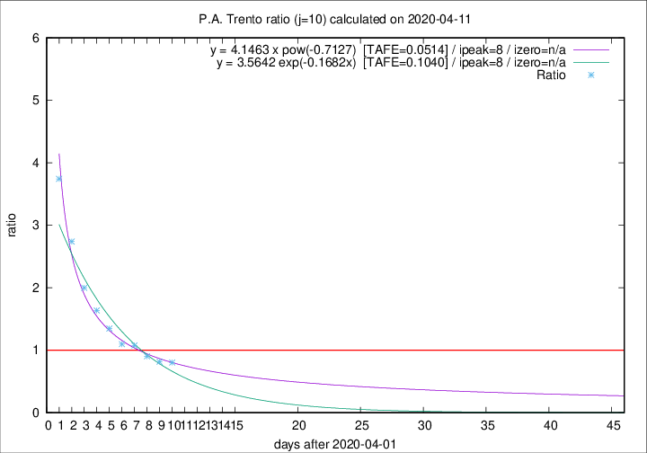

# P.A. Trento

Data source: https://raw.githubusercontent.com/pcm-dpc/COVID-19/master/dati-json/dpc-covid19-ita-regioni.json

Delta days analysis (j): 10

Analyses for other values of j for 2020-04-11 are avalable [here](../README.md)

Analyses for P.A. Trento for previous dates are avalable [here](../../README.md)

## Fitting 
|fit type|best fit equation|tafe|tfe|ipeak|izero|
|-------|-----|--------|------|---|---|
|exp|y = 3.5642 exp(-0.1682x)  [TAFE=0.1040]|0.1040|0.0078|8|n/a|
|pow|y = 4.1463 x pow(-0.7127)  [TAFE=0.0514]|0.0514|0.0017|8|n/a|

## Data
|Date|Daily deaths|Cumulated deaths|Deaths in the last 10 days|Deaths in the 10 days before|ratio|
|----|----------|-----------|-------|--------------------|-----|
|2020-04-11|9|284|111|138|0.8043|
|2020-04-10|7|275|111|136|0.8162|
|2020-04-09|13|268|121|134|0.9030|
|2020-04-08|11|255|126|117|1.0769|
|2020-04-07|14|244|124|113|1.0973|
|2020-04-06|13|230|128|95|1.3474|
|2020-04-05|7|217|131|80|1.6375|
|2020-04-04|6|210|136|68|2.0000|
|2020-04-03|17|204|148|54|2.7407|
|2020-04-02|14|187|146|39|3.7436|

[Download data as CSV](COVID-19_p.a._trento_j10_2020-04-11.csv)

Generated April 12th, 2020 at 16:28:18 UTC+0200 with https://github.com/robianc/COVID-19
