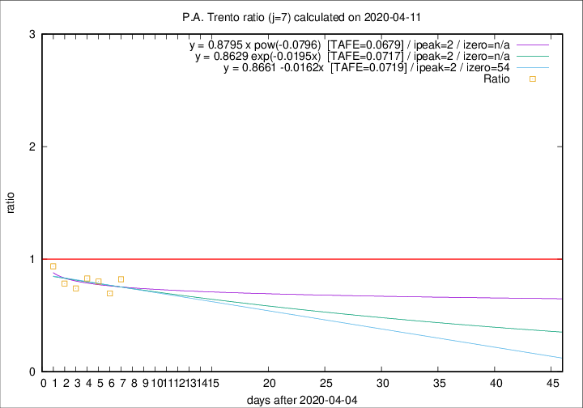

# P.A. Trento

Data source: https://raw.githubusercontent.com/pcm-dpc/COVID-19/master/dati-json/dpc-covid19-ita-regioni.json

Delta days analysis (j): 7

Analyses for other values of j for 2020-04-11 are avalable [here](../2020-04-11/README.md)

Analyses for P.A. Trento for previous dates are avalable [here](../README.md)

## Fitting 
|fit type|best fit equation|tafe|tfe|ipeak|izero|
|-------|-----|--------|------|---|---|
|linear|y = 0.8661 -0.0162x  [TAFE=0.0719]|0.0719|0.0061|2|54|
|exp|y = 0.8629 exp(-0.0195x)  [TAFE=0.0717]|0.0717|0.0029|2|n/a|
|pow|y = 0.8795 x pow(-0.0796)  [TAFE=0.0679]|0.0679|0.0025|2|n/a|

## Data
|Date|Daily deaths|Cumulated deaths|Deaths in the last 7 days|Deaths in the 7 days before|ratio|
|----|----------|-----------|-------|--------------------|-----|
|2020-04-11|9|284|74|90|0.8222|
|2020-04-10|7|275|71|102|0.6961|
|2020-04-09|13|268|81|101|0.8020|
|2020-04-08|11|255|82|99|0.8283|
|2020-04-07|14|244|80|108|0.7407|
|2020-04-06|13|230|83|106|0.7830|
|2020-04-05|7|217|88|94|0.9362|

[Download data as CSV](COVID-19_p.a._trento_j7_2020-04-11.csv)

Generated April 19th, 2020 at 18:42:39 UTC+0200 with https://github.com/robianc/COVID-19
