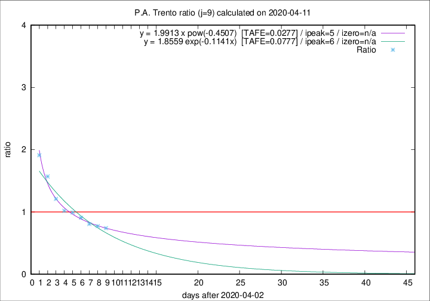

# P.A. Trento

Data source: https://raw.githubusercontent.com/pcm-dpc/COVID-19/master/dati-json/dpc-covid19-ita-regioni.json

Delta days analysis (j): 9

Analyses for other values of j for 2020-04-11 are avalable [here](../2020-04-11/README.md)

Analyses for P.A. Trento for previous dates are avalable [here](../README.md)

## Fitting 
|fit type|best fit equation|tafe|tfe|ipeak|izero|
|-------|-----|--------|------|---|---|
|exp|y = 1.8559 exp(-0.1141x)  [TAFE=0.0777]|0.0777|0.0041|6|n/a|
|pow|y = 1.9913 x pow(-0.4507)  [TAFE=0.0277]|0.0277|0.0007|5|n/a|

## Data
|Date|Daily deaths|Cumulated deaths|Deaths in the last 9 days|Deaths in the 9 days before|ratio|
|----|----------|-----------|-------|--------------------|-----|
|2020-04-11|9|284|97|131|0.7405|
|2020-04-10|7|275|102|132|0.7727|
|2020-04-09|13|268|104|129|0.8062|
|2020-04-08|11|255|108|119|0.9076|
|2020-04-07|14|244|115|116|0.9914|
|2020-04-06|13|230|110|108|1.0185|
|2020-04-05|7|217|115|95|1.2105|
|2020-04-04|6|210|124|79|1.5696|
|2020-04-03|17|204|130|68|1.9118|

[Download data as CSV](COVID-19_p.a._trento_j9_2020-04-11.csv)

Generated April 12th, 2020 at 17:02:01 UTC+0200 with https://github.com/robianc/COVID-19
