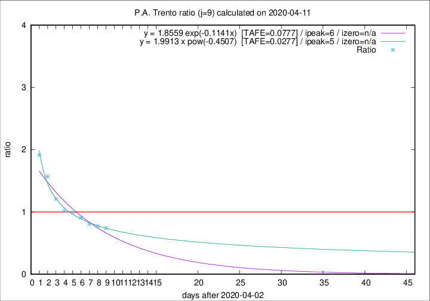
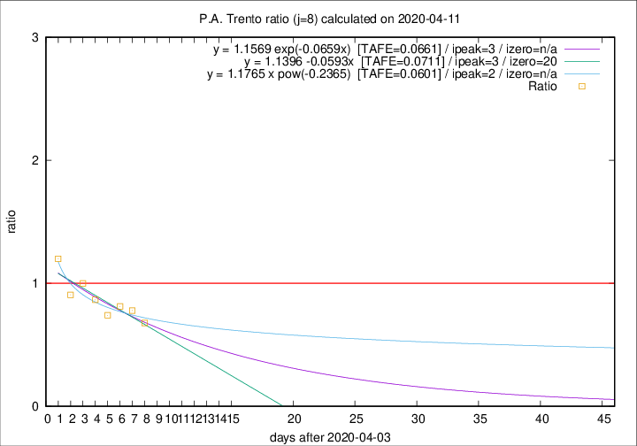

# P.A. Trento

Data source: https://raw.githubusercontent.com/pcm-dpc/COVID-19/master/dati-json/dpc-covid19-ita-regioni.json

Estimates in this page were made on 16/4/2020 with data available until 11/04/2020.

## Summary 

### Peak estimate 
|j|linear [TAFE]|exponential [TAFE]|power law [TAFE]|details|
|---|----|-----------|---------|-------|
|7|7/4/2020 [TAFE=0.0719]|7/4/2020 [TAFE=0.0717]|7/4/2020 [TAFE=0.0679]|[analysis](COVID-19_p.a._trento_j7_2020-04-11.md)|
|8|7/4/2020 [TAFE=0.0711]|7/4/2020 [TAFE=0.0661]|6/4/2020 [TAFE=0.0601]|[analysis](COVID-19_p.a._trento_j8_2020-04-11.md)|
|9|9/4/2020 [TAFE=0.1190]|9/4/2020 [TAFE=0.0777]|8/4/2020 [TAFE=0.0277]|[analysis](COVID-19_p.a._trento_j9_2020-04-11.md)|
|10|10/4/2020 [TAFE=0.2283]|10/4/2020 [TAFE=0.1040]|10/4/2020 [TAFE=0.0514]|[analysis](COVID-19_p.a._trento_j10_2020-04-11.md)|
|11|11/4/2020 [TAFE=0.2641]|11/4/2020 [TAFE=0.0746]|12/4/2020 [TAFE=0.1432]|[analysis](COVID-19_p.a._trento_j11_2020-04-11.md)|
|12|10/4/2020 [TAFE=0.6146]|12/4/2020 [TAFE=0.1356]|15/4/2020 [TAFE=0.1497]|[analysis](COVID-19_p.a._trento_j12_2020-04-11.md)|
|13|10/4/2020 [TAFE=0.7786]|12/4/2020 [TAFE=0.1403]|19/4/2020 [TAFE=0.2711]|[analysis](COVID-19_p.a._trento_j13_2020-04-11.md)|
|14|11/4/2020 [TAFE=0.6007]|14/4/2020 [TAFE=0.1603]|29/4/2020 [TAFE=0.4364]|[analysis](COVID-19_p.a._trento_j14_2020-04-11.md)|

Best estimator is pow with j=9 (TAFE=0.0277)
Corresponding peak date estimate is 8/4/2020 (ipeak 5)

Peak date range estimate: 5/4/2020 - 4/5/2020

### End estimate 
|j|linear [TAFE/TFE]|exponential [TAFE/TFE]|power law [TAFE/TFE]|details|
|---|----|-----------|---------|-------|
|7|29/5/2020 [TAFE=0.0719]|-|-|[analysis](COVID-19_p.a._trento_j7_2020-04-11.md)|
|8|24/4/2020 [TAFE=0.0711]|-|-|[analysis](COVID-19_p.a._trento_j8_2020-04-11.md)|
|9|-|-|-|[analysis](COVID-19_p.a._trento_j9_2020-04-11.md)|
|10|-|-|-|[analysis](COVID-19_p.a._trento_j10_2020-04-11.md)|
|11|-|-|-|[analysis](COVID-19_p.a._trento_j11_2020-04-11.md)|
|12|-|-|-|[analysis](COVID-19_p.a._trento_j12_2020-04-11.md)|
|13|-|-|-|[analysis](COVID-19_p.a._trento_j13_2020-04-11.md)|
|14|-|-|-|[analysis](COVID-19_p.a._trento_j14_2020-04-11.md)|

Best estimator is linear with j=8 (TAFE=0.0711)
Corresponding end date estimate is 24/4/2020 (izero 20)

End date range estimate: 4/4/2020 - 28/5/2020

Generated April 16th, 2020 at 20:09:19 UTC+0200 with https://github.com/robianc/COVID-19
