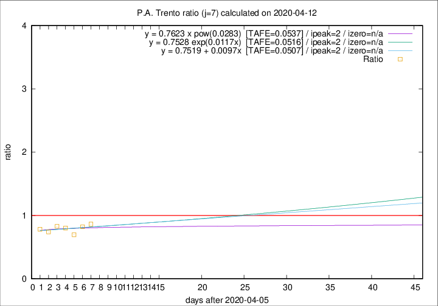

# P.A. Trento

Data source: https://raw.githubusercontent.com/pcm-dpc/COVID-19/master/dati-json/dpc-covid19-ita-regioni.json

Delta days analysis (j): 7

Analyses for other values of j for 2020-04-12 are avalable [here](../2020-04-12/README.md)

Analyses for P.A. Trento for previous dates are avalable [here](../README.md)

## Fitting 
|fit type|best fit equation|tafe|tfe|ipeak|izero|
|-------|-----|--------|------|---|---|
|linear|y = 0.7519 + 0.0097x  [TAFE=0.0507]|0.0507|0.0039|2|n/a|
|exp|y = 0.7528 exp(0.0117x)  [TAFE=0.0516]|0.0516|0.0018|2|n/a|
|pow|y = 0.7623 x pow(0.0283)  [TAFE=0.0537]|0.0537|0.0022|reached|n/a|

## Data
|Date|Daily deaths|Cumulated deaths|Deaths in the last 7 days|Deaths in the 7 days before|ratio|
|----|----------|-----------|-------|--------------------|-----|
|2020-04-12|9|293|76|88|0.8636|
|2020-04-11|9|284|74|90|0.8222|
|2020-04-10|7|275|71|102|0.6961|
|2020-04-09|13|268|81|101|0.8020|
|2020-04-08|11|255|82|99|0.8283|
|2020-04-07|14|244|80|108|0.7407|
|2020-04-06|13|230|83|106|0.7830|

[Download data as CSV](COVID-19_p.a._trento_j7_2020-04-12.csv)

Generated April 12th, 2020 at 17:02:01 UTC+0200 with https://github.com/robianc/COVID-19
