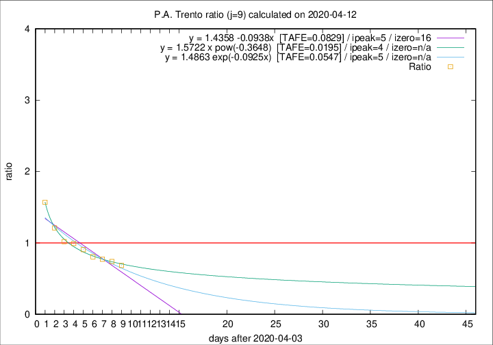

# P.A. Trento

Data source: https://raw.githubusercontent.com/pcm-dpc/COVID-19/master/dati-json/dpc-covid19-ita-regioni.json

Estimates in this page were made on 14/4/2020 with data available until 12/04/2020.

## Summary 

### Peak estimate 
|j|linear [TAFE]|exponential [TAFE]|power law [TAFE]|details|
|---|----|-----------|---------|-------|
|7|8/4/2020 [TAFE=0.0507]|8/4/2020 [TAFE=0.0516]|8/4/2020 [TAFE=0.0537]|[analysis](COVID-19_p.a._trento_j7_2020-04-12.md)|
|8|7/4/2020 [TAFE=0.0569]|7/4/2020 [TAFE=0.0571]|7/4/2020 [TAFE=0.0642]|[analysis](COVID-19_p.a._trento_j8_2020-04-12.md)|
|9|9/4/2020 [TAFE=0.0829]|9/4/2020 [TAFE=0.0547]|8/4/2020 [TAFE=0.0195]|[analysis](COVID-19_p.a._trento_j9_2020-04-12.md)|
|10|11/4/2020 [TAFE=0.1663]|10/4/2020 [TAFE=0.0866]|10/4/2020 [TAFE=0.0409]|[analysis](COVID-19_p.a._trento_j10_2020-04-12.md)|
|11|11/4/2020 [TAFE=0.2623]|11/4/2020 [TAFE=0.0916]|12/4/2020 [TAFE=0.1090]|[analysis](COVID-19_p.a._trento_j11_2020-04-12.md)|
|12|11/4/2020 [TAFE=0.5551]|12/4/2020 [TAFE=0.1259]|14/4/2020 [TAFE=0.1048]|[analysis](COVID-19_p.a._trento_j12_2020-04-12.md)|
|13|11/4/2020 [TAFE=0.8647]|13/4/2020 [TAFE=0.1597]|16/4/2020 [TAFE=0.1589]|[analysis](COVID-19_p.a._trento_j13_2020-04-12.md)|
|14|11/4/2020 [TAFE=0.8009]|14/4/2020 [TAFE=0.1413]|22/4/2020 [TAFE=0.3371]|[analysis](COVID-19_p.a._trento_j14_2020-04-12.md)|

Best estimator is pow with j=9 (TAFE=0.0195)
Corresponding peak date estimate is 8/4/2020 (ipeak 4)

Peak date range estimate: 6/4/2020 - 27/4/2020

### End estimate 
|j|linear [TAFE/TFE]|exponential [TAFE/TFE]|power law [TAFE/TFE]|details|
|---|----|-----------|---------|-------|
|7|-|-|-|[analysis](COVID-19_p.a._trento_j7_2020-04-12.md)|
|8|5/5/2020 [TAFE=0.0569]|-|-|[analysis](COVID-19_p.a._trento_j8_2020-04-12.md)|
|9|-|-|-|[analysis](COVID-19_p.a._trento_j9_2020-04-12.md)|
|10|-|-|-|[analysis](COVID-19_p.a._trento_j10_2020-04-12.md)|
|11|-|-|-|[analysis](COVID-19_p.a._trento_j11_2020-04-12.md)|
|12|-|-|-|[analysis](COVID-19_p.a._trento_j12_2020-04-12.md)|
|13|-|-|-|[analysis](COVID-19_p.a._trento_j13_2020-04-12.md)|
|14|-|-|-|[analysis](COVID-19_p.a._trento_j14_2020-04-12.md)|

Best estimator is linear with j=8 (TAFE=0.0569)
Corresponding end date estimate is 5/5/2020 (izero 30)

End date range estimate: 5/4/2020 - 5/5/2020

Generated April 14th, 2020 at 19:16:04 UTC+0200 with https://github.com/robianc/COVID-19
