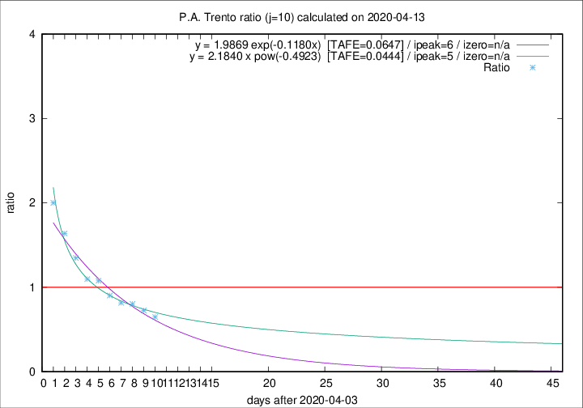

# P.A. Trento

Data source: https://raw.githubusercontent.com/pcm-dpc/COVID-19/master/dati-json/dpc-covid19-ita-regioni.json

Delta days analysis (j): 10

Analyses for other values of j for 2020-04-13 are avalable [here](../2020-04-13/README.md)

Analyses for P.A. Trento for previous dates are avalable [here](../README.md)

## Fitting 
|fit type|best fit equation|tafe|tfe|ipeak|izero|
|-------|-----|--------|------|---|---|
|exp|y = 1.9869 exp(-0.1180x)  [TAFE=0.0647]|0.0647|0.0027|6|n/a|
|pow|y = 2.1840 x pow(-0.4923)  [TAFE=0.0444]|0.0444|0.0015|5|n/a|

## Data
|Date|Daily deaths|Cumulated deaths|Deaths in the last 10 days|Deaths in the 10 days before|ratio|
|----|----------|-----------|-------|--------------------|-----|
|2020-04-13|7|300|96|148|0.6486|
|2020-04-12|9|293|106|146|0.7260|
|2020-04-11|9|284|111|138|0.8043|
|2020-04-10|7|275|111|136|0.8162|
|2020-04-09|13|268|121|134|0.9030|
|2020-04-08|11|255|126|117|1.0769|
|2020-04-07|14|244|124|113|1.0973|
|2020-04-06|13|230|128|95|1.3474|
|2020-04-05|7|217|131|80|1.6375|
|2020-04-04|6|210|136|68|2.0000|

[Download data as CSV](COVID-19_p.a._trento_j10_2020-04-13.csv)

Generated April 16th, 2020 at 20:09:19 UTC+0200 with https://github.com/robianc/COVID-19
