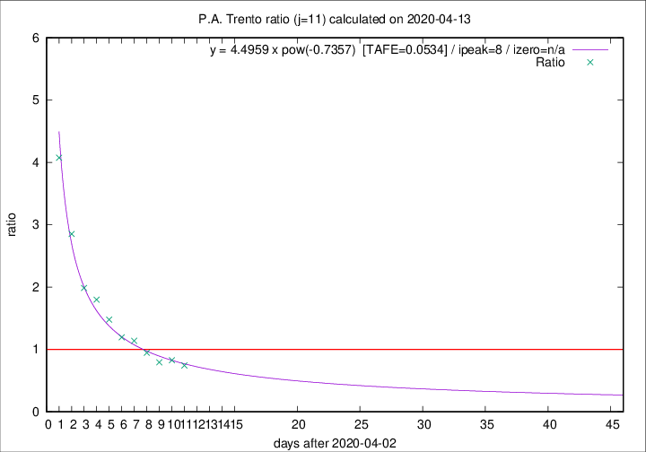

# P.A. Trento

Data source: https://raw.githubusercontent.com/pcm-dpc/COVID-19/master/dati-json/dpc-covid19-ita-regioni.json

Delta days analysis (j): 11

Analyses for other values of j for 2020-04-13 are avalable [here](../2020-04-13/README.md)

Analyses for P.A. Trento for previous dates are avalable [here](../README.md)

## Fitting 
|fit type|best fit equation|tafe|tfe|ipeak|izero|
|-------|-----|--------|------|---|---|
|pow|y = 4.4959 x pow(-0.7357)  [TAFE=0.0534]|0.0534|0.0022|8|n/a|

## Data
|Date|Daily deaths|Cumulated deaths|Deaths in the last 11 days|Deaths in the 11 days before|ratio|
|----|----------|-----------|-------|--------------------|-----|
|2020-04-13|7|300|113|152|0.7434|
|2020-04-12|9|293|120|145|0.8276|
|2020-04-11|9|284|120|151|0.7947|
|2020-04-10|7|275|128|135|0.9481|
|2020-04-09|13|268|139|122|1.1393|
|2020-04-08|11|255|135|113|1.1947|
|2020-04-07|14|244|142|96|1.4792|
|2020-04-06|13|230|144|80|1.8000|
|2020-04-05|7|217|143|72|1.9861|
|2020-04-04|6|210|154|54|2.8519|
|2020-04-03|17|204|163|40|4.0750|

[Download data as CSV](COVID-19_p.a._trento_j11_2020-04-13.csv)

Generated April 14th, 2020 at 19:16:04 UTC+0200 with https://github.com/robianc/COVID-19
