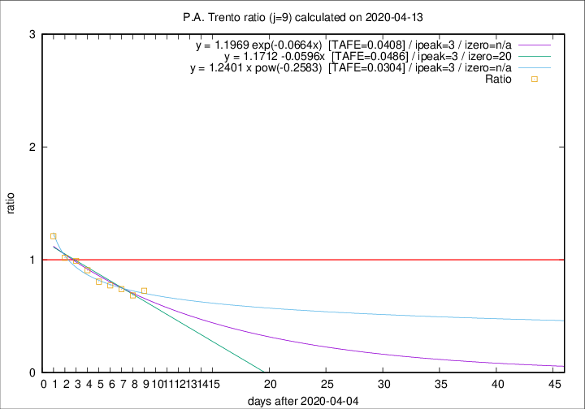

# P.A. Trento

Data source: https://raw.githubusercontent.com/pcm-dpc/COVID-19/master/dati-json/dpc-covid19-ita-regioni.json

Delta days analysis (j): 9

Analyses for other values of j for 2020-04-13 are avalable [here](../2020-04-13/README.md)

Analyses for P.A. Trento for previous dates are avalable [here](../README.md)

## Fitting 
|fit type|best fit equation|tafe|tfe|ipeak|izero|
|-------|-----|--------|------|---|---|
|linear|y = 1.1712 -0.0596x  [TAFE=0.0486]|0.0486|0.0026|3|20|
|exp|y = 1.1969 exp(-0.0664x)  [TAFE=0.0408]|0.0408|0.0011|3|n/a|
|pow|y = 1.2401 x pow(-0.2583)  [TAFE=0.0304]|0.0304|0.0006|3|n/a|

## Data
|Date|Daily deaths|Cumulated deaths|Deaths in the last 9 days|Deaths in the 9 days before|ratio|
|----|----------|-----------|-------|--------------------|-----|
|2020-04-13|7|300|90|124|0.7258|
|2020-04-12|9|293|89|130|0.6846|
|2020-04-11|9|284|97|131|0.7405|
|2020-04-10|7|275|102|132|0.7727|
|2020-04-09|13|268|104|129|0.8062|
|2020-04-08|11|255|108|119|0.9076|
|2020-04-07|14|244|115|116|0.9914|
|2020-04-06|13|230|110|108|1.0185|
|2020-04-05|7|217|115|95|1.2105|

[Download data as CSV](COVID-19_p.a._trento_j9_2020-04-13.csv)

Generated April 16th, 2020 at 20:09:19 UTC+0200 with https://github.com/robianc/COVID-19
