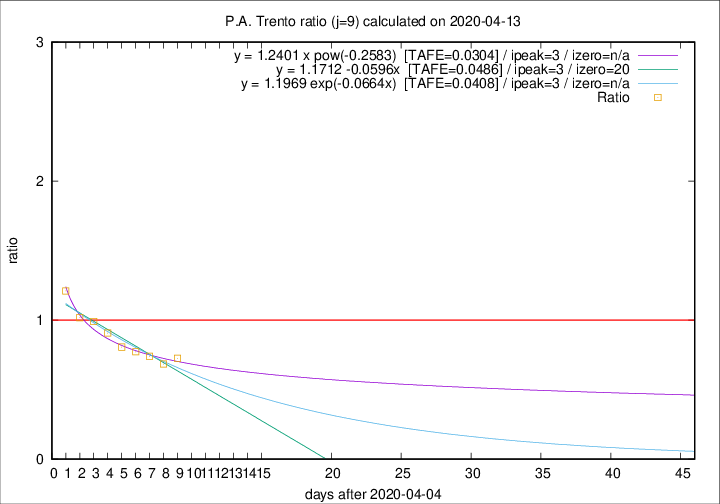

# P.A. Trento

Data source: https://raw.githubusercontent.com/pcm-dpc/COVID-19/master/dati-json/dpc-covid19-ita-regioni.json

Estimates in this page were made on 14/4/2020 with data available until 13/04/2020.

## Summary 

### Peak estimate 
|j|linear [TAFE]|exponential [TAFE]|power law [TAFE]|details|
|---|----|-----------|---------|-------|
|7|9/4/2020 [TAFE=0.0449]|9/4/2020 [TAFE=0.0455]|9/4/2020 [TAFE=0.0456]|[analysis](COVID-19_p.a._trento_j7_2020-04-13.md)|
|8|8/4/2020 [TAFE=0.0748]|8/4/2020 [TAFE=0.0732]|8/4/2020 [TAFE=0.0604]|[analysis](COVID-19_p.a._trento_j8_2020-04-13.md)|
|9|8/4/2020 [TAFE=0.0486]|8/4/2020 [TAFE=0.0408]|8/4/2020 [TAFE=0.0304]|[analysis](COVID-19_p.a._trento_j9_2020-04-13.md)|
|10|11/4/2020 [TAFE=0.1193]|10/4/2020 [TAFE=0.0647]|9/4/2020 [TAFE=0.0444]|[analysis](COVID-19_p.a._trento_j10_2020-04-13.md)|
|11|12/4/2020 [TAFE=0.2500]|12/4/2020 [TAFE=0.1139]|11/4/2020 [TAFE=0.0534]|[analysis](COVID-19_p.a._trento_j11_2020-04-13.md)|
|12|12/4/2020 [TAFE=0.3039]|12/4/2020 [TAFE=0.0795]|14/4/2020 [TAFE=0.1381]|[analysis](COVID-19_p.a._trento_j12_2020-04-13.md)|
|13|12/4/2020 [TAFE=0.7082]|13/4/2020 [TAFE=0.1455]|16/4/2020 [TAFE=0.1604]|[analysis](COVID-19_p.a._trento_j13_2020-04-13.md)|
|14|12/4/2020 [TAFE=0.9455]|14/4/2020 [TAFE=0.1543]|19/4/2020 [TAFE=0.2659]|[analysis](COVID-19_p.a._trento_j14_2020-04-13.md)|

Best estimator is pow with j=9 (TAFE=0.0304)
Corresponding peak date estimate is 8/4/2020 (ipeak 3)

Peak date range estimate: 7/4/2020 - 24/4/2020

### End estimate 
|j|linear [TAFE/TFE]|exponential [TAFE/TFE]|power law [TAFE/TFE]|details|
|---|----|-----------|---------|-------|
|7|-|-|-|[analysis](COVID-19_p.a._trento_j7_2020-04-13.md)|
|8|21/5/2020 [TAFE=0.0748]|-|-|[analysis](COVID-19_p.a._trento_j8_2020-04-13.md)|
|9|25/4/2020 [TAFE=0.0486]|-|-|[analysis](COVID-19_p.a._trento_j9_2020-04-13.md)|
|10|-|-|-|[analysis](COVID-19_p.a._trento_j10_2020-04-13.md)|
|11|-|-|-|[analysis](COVID-19_p.a._trento_j11_2020-04-13.md)|
|12|-|-|-|[analysis](COVID-19_p.a._trento_j12_2020-04-13.md)|
|13|-|-|-|[analysis](COVID-19_p.a._trento_j13_2020-04-13.md)|
|14|-|-|-|[analysis](COVID-19_p.a._trento_j14_2020-04-13.md)|

Best estimator is linear with j=9 (TAFE=0.0486)
Corresponding end date estimate is 25/4/2020 (izero 20)

End date range estimate: 5/4/2020 - 20/5/2020

Generated April 14th, 2020 at 19:16:04 UTC+0200 with https://github.com/robianc/COVID-19
