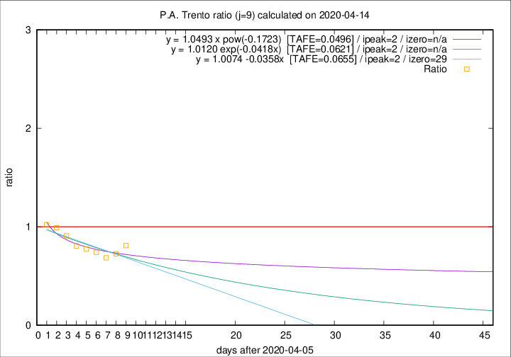

# P.A. Trento

Data source: https://raw.githubusercontent.com/pcm-dpc/COVID-19/master/dati-json/dpc-covid19-ita-regioni.json

Estimates in this page were made on 14/4/2020 with data available until 14/04/2020.

## Summary 

### Peak estimate 
|j|linear [TAFE]|exponential [TAFE]|power law [TAFE]|details|
|---|----|-----------|---------|-------|
|7|10/4/2020 [TAFE=0.0443]|10/4/2020 [TAFE=0.0452]|10/4/2020 [TAFE=0.0437]|[analysis](COVID-19_p.a._trento_j7_2020-04-14.md)|
|8|9/4/2020 [TAFE=0.0591]|9/4/2020 [TAFE=0.0589]|9/4/2020 [TAFE=0.0572]|[analysis](COVID-19_p.a._trento_j8_2020-04-14.md)|
|9|8/4/2020 [TAFE=0.0655]|8/4/2020 [TAFE=0.0621]|8/4/2020 [TAFE=0.0496]|[analysis](COVID-19_p.a._trento_j9_2020-04-14.md)|
|10|11/4/2020 [TAFE=0.0913]|10/4/2020 [TAFE=0.0681]|9/4/2020 [TAFE=0.0421]|[analysis](COVID-19_p.a._trento_j10_2020-04-14.md)|
|11|12/4/2020 [TAFE=0.1769]|12/4/2020 [TAFE=0.0797]|11/4/2020 [TAFE=0.0634]|[analysis](COVID-19_p.a._trento_j11_2020-04-14.md)|
|12|13/4/2020 [TAFE=0.2955]|13/4/2020 [TAFE=0.0991]|13/4/2020 [TAFE=0.1038]|[analysis](COVID-19_p.a._trento_j12_2020-04-14.md)|
|13|13/4/2020 [TAFE=0.6219]|13/4/2020 [TAFE=0.1295]|15/4/2020 [TAFE=0.1012]|[analysis](COVID-19_p.a._trento_j13_2020-04-14.md)|
|14|13/4/2020 [TAFE=1.0186]|14/4/2020 [TAFE=0.1809]|17/4/2020 [TAFE=0.1658]|[analysis](COVID-19_p.a._trento_j14_2020-04-14.md)|

Best estimator is pow with j=10 (TAFE=0.0421)
Corresponding peak date estimate is 9/4/2020 (ipeak 4)

Peak date range estimate: 7/4/2020 - 21/4/2020

### End estimate 
|j|linear [TAFE/TFE]|exponential [TAFE/TFE]|power law [TAFE/TFE]|details|
|---|----|-----------|---------|-------|
|7|-|-|-|[analysis](COVID-19_p.a._trento_j7_2020-04-14.md)|
|8|-|-|-|[analysis](COVID-19_p.a._trento_j8_2020-04-14.md)|
|9|5/5/2020 [TAFE=0.0655]|-|-|[analysis](COVID-19_p.a._trento_j9_2020-04-14.md)|
|10|-|-|-|[analysis](COVID-19_p.a._trento_j10_2020-04-14.md)|
|11|-|-|-|[analysis](COVID-19_p.a._trento_j11_2020-04-14.md)|
|12|-|-|-|[analysis](COVID-19_p.a._trento_j12_2020-04-14.md)|
|13|-|-|-|[analysis](COVID-19_p.a._trento_j13_2020-04-14.md)|
|14|-|-|-|[analysis](COVID-19_p.a._trento_j14_2020-04-14.md)|

Best estimator is linear with j=9 (TAFE=0.0655)
Corresponding end date estimate is 5/5/2020 (izero 29)

End date range estimate: 6/4/2020 - 5/5/2020

Generated April 14th, 2020 at 19:16:04 UTC+0200 with https://github.com/robianc/COVID-19
