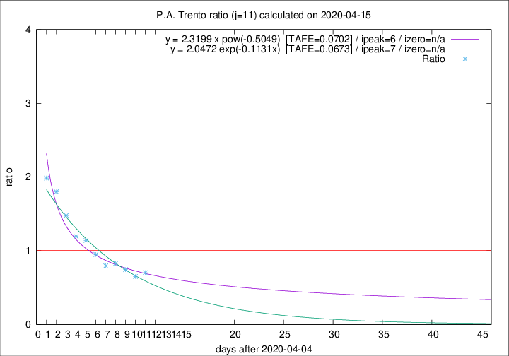

# P.A. Trento

Data source: https://raw.githubusercontent.com/pcm-dpc/COVID-19/master/dati-json/dpc-covid19-ita-regioni.json

Delta days analysis (j): 11

Analyses for other values of j for 2020-04-15 are avalable [here](../2020-04-15/README.md)

Analyses for P.A. Trento for previous dates are avalable [here](../README.md)

## Fitting 
|fit type|best fit equation|tafe|tfe|ipeak|izero|
|-------|-----|--------|------|---|---|
|exp|y = 2.0472 exp(-0.1131x)  [TAFE=0.0673]|0.0673|0.0036|7|n/a|
|pow|y = 2.3199 x pow(-0.5049)  [TAFE=0.0702]|0.0702|0.0036|6|n/a|

## Data
|Date|Daily deaths|Cumulated deaths|Deaths in the last 11 days|Deaths in the 11 days before|ratio|
|----|----------|-----------|-------|--------------------|-----|
|2020-04-15|8|318|108|154|0.7013|
|2020-04-14|10|310|106|163|0.6503|
|2020-04-13|7|300|113|152|0.7434|
|2020-04-12|9|293|120|145|0.8276|
|2020-04-11|9|284|120|151|0.7947|
|2020-04-10|7|275|128|135|0.9481|
|2020-04-09|13|268|139|122|1.1393|
|2020-04-08|11|255|135|113|1.1947|
|2020-04-07|14|244|142|96|1.4792|
|2020-04-06|13|230|144|80|1.8000|
|2020-04-05|7|217|143|72|1.9861|

[Download data as CSV](COVID-19_p.a._trento_j11_2020-04-15.csv)

Generated April 19th, 2020 at 18:42:39 UTC+0200 with https://github.com/robianc/COVID-19
