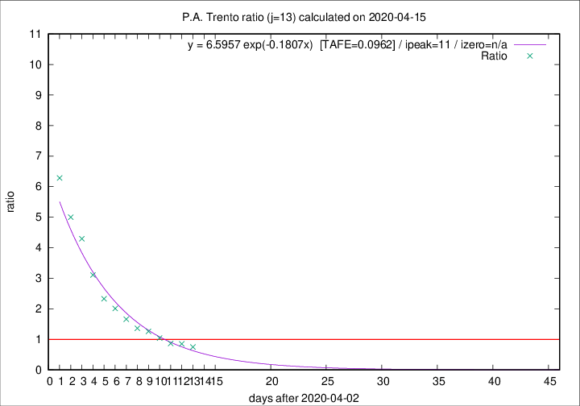

# P.A. Trento

Data source: https://raw.githubusercontent.com/pcm-dpc/COVID-19/master/dati-json/dpc-covid19-ita-regioni.json

Delta days analysis (j): 13

Analyses for other values of j for 2020-04-15 are avalable [here](../2020-04-15/README.md)

Analyses for P.A. Trento for previous dates are avalable [here](../README.md)

## Fitting 
|fit type|best fit equation|tafe|tfe|ipeak|izero|
|-------|-----|--------|------|---|---|
|exp|y = 6.5957 exp(-0.1807x)  [TAFE=0.0962]|0.0962|0.0056|11|n/a|

## Data
|Date|Daily deaths|Cumulated deaths|Deaths in the last 13 days|Deaths in the 13 days before|ratio|
|----|----------|-----------|-------|--------------------|-----|
|2020-04-15|8|318|131|174|0.7529|
|2020-04-14|10|310|137|161|0.8509|
|2020-04-13|7|300|136|157|0.8662|
|2020-04-12|9|293|146|140|1.0429|
|2020-04-11|9|284|155|123|1.2602|
|2020-04-10|7|275|155|114|1.3596|
|2020-04-09|13|268|166|100|1.6600|
|2020-04-08|11|255|169|84|2.0119|
|2020-04-07|14|244|170|73|2.3288|
|2020-04-06|13|230|174|56|3.1071|
|2020-04-05|7|217|176|41|4.2927|
|2020-04-04|6|210|175|35|5.0000|
|2020-04-03|17|204|176|28|6.2857|

[Download data as CSV](COVID-19_p.a._trento_j13_2020-04-15.csv)

Generated April 19th, 2020 at 18:42:39 UTC+0200 with https://github.com/robianc/COVID-19
