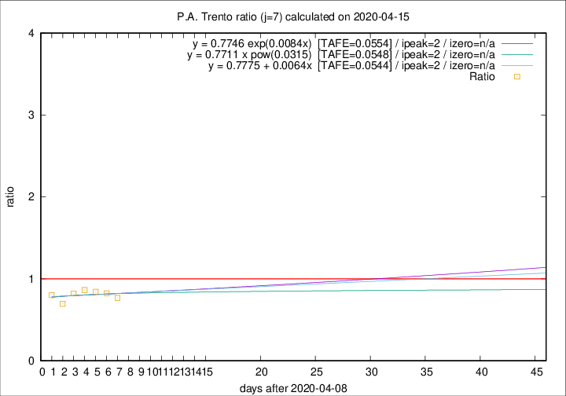

# P.A. Trento

Data source: https://raw.githubusercontent.com/pcm-dpc/COVID-19/master/dati-json/dpc-covid19-ita-regioni.json

Delta days analysis (j): 7

Analyses for other values of j for 2020-04-15 are avalable [here](../2020-04-15/README.md)

Analyses for P.A. Trento for previous dates are avalable [here](../README.md)

## Fitting 
|fit type|best fit equation|tafe|tfe|ipeak|izero|
|-------|-----|--------|------|---|---|
|linear|y = 0.7775 + 0.0064x  [TAFE=0.0544]|0.0544|0.0044|2|n/a|
|exp|y = 0.7746 exp(0.0084x)  [TAFE=0.0554]|0.0554|0.0020|2|n/a|
|pow|y = 0.7711 x pow(0.0315)  [TAFE=0.0548]|0.0548|0.0022|2|n/a|

## Data
|Date|Daily deaths|Cumulated deaths|Deaths in the last 7 days|Deaths in the 7 days before|ratio|
|----|----------|-----------|-------|--------------------|-----|
|2020-04-15|8|318|63|82|0.7683|
|2020-04-14|10|310|66|80|0.8250|
|2020-04-13|7|300|70|83|0.8434|
|2020-04-12|9|293|76|88|0.8636|
|2020-04-11|9|284|74|90|0.8222|
|2020-04-10|7|275|71|102|0.6961|
|2020-04-09|13|268|81|101|0.8020|

[Download data as CSV](COVID-19_p.a._trento_j7_2020-04-15.csv)

Generated April 19th, 2020 at 18:42:39 UTC+0200 with https://github.com/robianc/COVID-19
