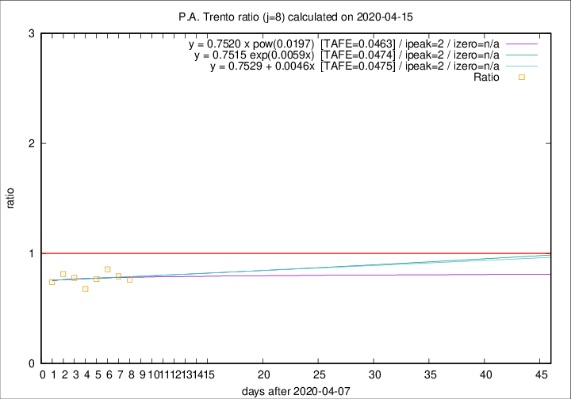
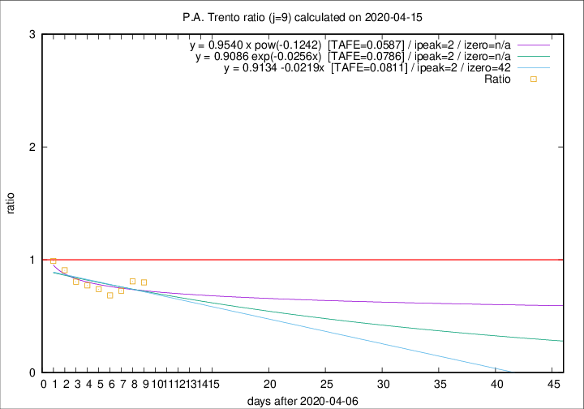

# P.A. Trento

Data source: https://raw.githubusercontent.com/pcm-dpc/COVID-19/master/dati-json/dpc-covid19-ita-regioni.json

Estimates in this page were made on 16/4/2020 with data available until 15/04/2020.

## Summary 

### Peak estimate 
|j|linear [TAFE]|exponential [TAFE]|power law [TAFE]|details|
|---|----|-----------|---------|-------|
|7|11/4/2020 [TAFE=0.0544]|11/4/2020 [TAFE=0.0554]|11/4/2020 [TAFE=0.0548]|[analysis](COVID-19_p.a._trento_j7_2020-04-15.md)|
|8|10/4/2020 [TAFE=0.0475]|10/4/2020 [TAFE=0.0474]|10/4/2020 [TAFE=0.0463]|[analysis](COVID-19_p.a._trento_j8_2020-04-15.md)|
|9|9/4/2020 [TAFE=0.0811]|9/4/2020 [TAFE=0.0786]|9/4/2020 [TAFE=0.0587]|[analysis](COVID-19_p.a._trento_j9_2020-04-15.md)|
|10|10/4/2020 [TAFE=0.0991]|10/4/2020 [TAFE=0.0839]|9/4/2020 [TAFE=0.0477]|[analysis](COVID-19_p.a._trento_j10_2020-04-15.md)|
|11|12/4/2020 [TAFE=0.1237]|12/4/2020 [TAFE=0.0673]|11/4/2020 [TAFE=0.0702]|[analysis](COVID-19_p.a._trento_j11_2020-04-15.md)|
|12|13/4/2020 [TAFE=0.2623]|13/4/2020 [TAFE=0.0976]|13/4/2020 [TAFE=0.0697]|[analysis](COVID-19_p.a._trento_j12_2020-04-15.md)|
|13|14/4/2020 [TAFE=0.3505]|14/4/2020 [TAFE=0.0962]|15/4/2020 [TAFE=0.1330]|[analysis](COVID-19_p.a._trento_j13_2020-04-15.md)|
|14|14/4/2020 [TAFE=0.8190]|15/4/2020 [TAFE=0.1621]|17/4/2020 [TAFE=0.1572]|[analysis](COVID-19_p.a._trento_j14_2020-04-15.md)|

Best estimator is pow with j=8 (TAFE=0.0463)
Corresponding peak date estimate is 10/4/2020 (ipeak 2)

Peak date range estimate: 10/4/2020 - 23/4/2020

### End estimate 
|j|linear [TAFE/TFE]|exponential [TAFE/TFE]|power law [TAFE/TFE]|details|
|---|----|-----------|---------|-------|
|7|-|-|-|[analysis](COVID-19_p.a._trento_j7_2020-04-15.md)|
|8|-|-|-|[analysis](COVID-19_p.a._trento_j8_2020-04-15.md)|
|9|19/5/2020 [TAFE=0.0811]|-|-|[analysis](COVID-19_p.a._trento_j9_2020-04-15.md)|
|10|-|-|-|[analysis](COVID-19_p.a._trento_j10_2020-04-15.md)|
|11|-|-|-|[analysis](COVID-19_p.a._trento_j11_2020-04-15.md)|
|12|-|-|-|[analysis](COVID-19_p.a._trento_j12_2020-04-15.md)|
|13|-|-|-|[analysis](COVID-19_p.a._trento_j13_2020-04-15.md)|
|14|-|-|-|[analysis](COVID-19_p.a._trento_j14_2020-04-15.md)|

Best estimator is linear with j=9 (TAFE=0.0811)
Corresponding end date estimate is 19/5/2020 (izero 42)

End date range estimate: 7/4/2020 - 19/5/2020

Generated April 16th, 2020 at 20:09:19 UTC+0200 with https://github.com/robianc/COVID-19
