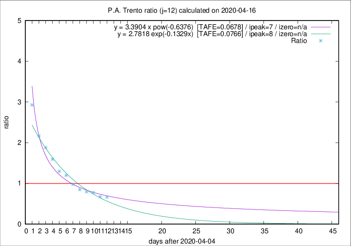

# P.A. Trento

Data source: https://raw.githubusercontent.com/pcm-dpc/COVID-19/master/dati-json/dpc-covid19-ita-regioni.json

Delta days analysis (j): 12

Analyses for other values of j for 2020-04-16 are avalable [here](../2020-04-16/README.md)

Analyses for P.A. Trento for previous dates are avalable [here](../README.md)

## Fitting 
|fit type|best fit equation|tafe|tfe|ipeak|izero|
|-------|-----|--------|------|---|---|
|exp|y = 2.7818 exp(-0.1329x)  [TAFE=0.0766]|0.0766|0.0048|8|n/a|
|pow|y = 3.3904 x pow(-0.6376)  [TAFE=0.0678]|0.0678|0.0034|7|n/a|

## Data
|Date|Daily deaths|Cumulated deaths|Deaths in the last 12 days|Deaths in the 12 days before|ratio|
|----|----------|-----------|-------|--------------------|-----|
|2020-04-16|4|322|112|169|0.6627|
|2020-04-15|8|318|114|169|0.6746|
|2020-04-14|10|310|123|159|0.7736|
|2020-04-13|7|300|127|160|0.7937|
|2020-04-12|9|293|129|152|0.8487|
|2020-04-11|9|284|137|140|0.9786|
|2020-04-10|7|275|146|122|1.1967|
|2020-04-09|13|268|148|114|1.2982|
|2020-04-08|11|255|153|96|1.5938|
|2020-04-07|14|244|158|84|1.8810|
|2020-04-06|13|230|156|72|2.1667|
|2020-04-05|7|217|161|55|2.9273|

[Download data as CSV](COVID-19_p.a._trento_j12_2020-04-16.csv)

Generated April 16th, 2020 at 20:09:19 UTC+0200 with https://github.com/robianc/COVID-19
