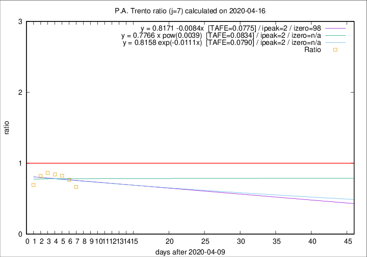

# P.A. Trento

Data source: https://raw.githubusercontent.com/pcm-dpc/COVID-19/master/dati-json/dpc-covid19-ita-regioni.json

Delta days analysis (j): 7

Analyses for other values of j for 2020-04-16 are avalable [here](../2020-04-16/README.md)

Analyses for P.A. Trento for previous dates are avalable [here](../README.md)

## Fitting 
|fit type|best fit equation|tafe|tfe|ipeak|izero|
|-------|-----|--------|------|---|---|
|linear|y = 0.8171 -0.0084x  [TAFE=0.0775]|0.0775|0.0080|2|98|
|exp|y = 0.8158 exp(-0.0111x)  [TAFE=0.0790]|0.0790|0.0042|2|n/a|
|pow|y = 0.7766 x pow(0.0039)  [TAFE=0.0834]|0.0834|0.0044|2|n/a|

## Data
|Date|Daily deaths|Cumulated deaths|Deaths in the last 7 days|Deaths in the 7 days before|ratio|
|----|----------|-----------|-------|--------------------|-----|
|2020-04-16|4|322|54|81|0.6667|
|2020-04-15|8|318|63|82|0.7683|
|2020-04-14|10|310|66|80|0.8250|
|2020-04-13|7|300|70|83|0.8434|
|2020-04-12|9|293|76|88|0.8636|
|2020-04-11|9|284|74|90|0.8222|
|2020-04-10|7|275|71|102|0.6961|

[Download data as CSV](COVID-19_p.a._trento_j7_2020-04-16.csv)

Generated April 16th, 2020 at 20:09:19 UTC+0200 with https://github.com/robianc/COVID-19
