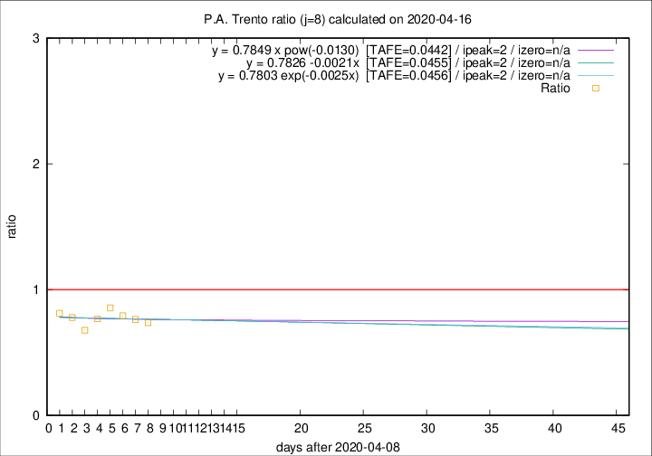

# P.A. Trento

Data source: https://raw.githubusercontent.com/pcm-dpc/COVID-19/master/dati-json/dpc-covid19-ita-regioni.json

Estimates in this page were made on 19/4/2020 with data available until 16/04/2020.

## Summary 

### Peak estimate 
|j|linear [TAFE]|exponential [TAFE]|power law [TAFE]|details|
|---|----|-----------|---------|-------|
|7|12/4/2020 [TAFE=0.0775]|12/4/2020 [TAFE=0.0790]|12/4/2020 [TAFE=0.0834]|[analysis](COVID-19_p.a._trento_j7_2020-04-16.md)|
|8|11/4/2020 [TAFE=0.0455]|11/4/2020 [TAFE=0.0456]|11/4/2020 [TAFE=0.0442]|[analysis](COVID-19_p.a._trento_j8_2020-04-16.md)|
|9|10/4/2020 [TAFE=0.0644]|10/4/2020 [TAFE=0.0628]|10/4/2020 [TAFE=0.0540]|[analysis](COVID-19_p.a._trento_j9_2020-04-16.md)|
|10|9/4/2020 [TAFE=0.0887]|9/4/2020 [TAFE=0.0791]|9/4/2020 [TAFE=0.0522]|[analysis](COVID-19_p.a._trento_j10_2020-04-16.md)|
|11|13/4/2020 [TAFE=0.1352]|12/4/2020 [TAFE=0.0945]|11/4/2020 [TAFE=0.0528]|[analysis](COVID-19_p.a._trento_j11_2020-04-16.md)|
|12|14/4/2020 [TAFE=0.1856]|13/4/2020 [TAFE=0.0766]|12/4/2020 [TAFE=0.0678]|[analysis](COVID-19_p.a._trento_j12_2020-04-16.md)|
|13|14/4/2020 [TAFE=0.3280]|14/4/2020 [TAFE=0.1005]|14/4/2020 [TAFE=0.1152]|[analysis](COVID-19_p.a._trento_j13_2020-04-16.md)|
|14|14/4/2020 [TAFE=0.7035]|15/4/2020 [TAFE=0.1371]|16/4/2020 [TAFE=0.1083]|[analysis](COVID-19_p.a._trento_j14_2020-04-16.md)|

Best estimator is pow with j=8 (TAFE=0.0442)
Corresponding peak date estimate is 11/4/2020 (ipeak 2)

Peak date range estimate: 11/4/2020 - 22/4/2020

### End estimate 
|j|linear [TAFE/TFE]|exponential [TAFE/TFE]|power law [TAFE/TFE]|details|
|---|----|-----------|---------|-------|
|7|17/7/2020 [TAFE=0.0775]|-|-|[analysis](COVID-19_p.a._trento_j7_2020-04-16.md)|
|8|-|-|-|[analysis](COVID-19_p.a._trento_j8_2020-04-16.md)|
|9|5/6/2020 [TAFE=0.0644]|-|-|[analysis](COVID-19_p.a._trento_j9_2020-04-16.md)|
|10|-|-|-|[analysis](COVID-19_p.a._trento_j10_2020-04-16.md)|
|11|-|-|-|[analysis](COVID-19_p.a._trento_j11_2020-04-16.md)|
|12|-|-|-|[analysis](COVID-19_p.a._trento_j12_2020-04-16.md)|
|13|-|-|-|[analysis](COVID-19_p.a._trento_j13_2020-04-16.md)|
|14|-|-|-|[analysis](COVID-19_p.a._trento_j14_2020-04-16.md)|

Best estimator is linear with j=9 (TAFE=0.0644)
Corresponding end date estimate is 5/6/2020 (izero 58)

End date range estimate: 8/4/2020 - 15/7/2020

Generated April 19th, 2020 at 18:42:39 UTC+0200 with https://github.com/robianc/COVID-19
