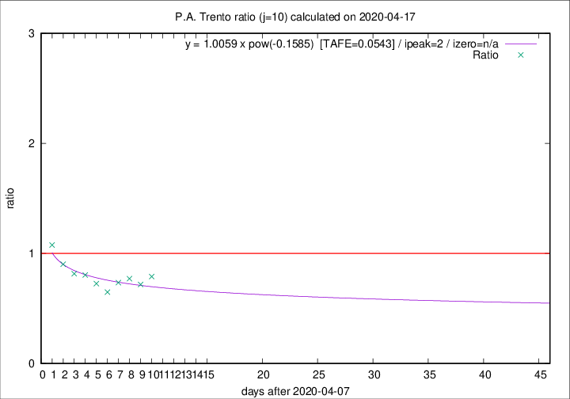

# P.A. Trento

Data source: https://raw.githubusercontent.com/pcm-dpc/COVID-19/master/dati-json/dpc-covid19-ita-regioni.json

Delta days analysis (j): 10

Analyses for other values of j for 2020-04-17 are avalable [here](../2020-04-17/README.md)

Analyses for P.A. Trento for previous dates are avalable [here](../README.md)

## Fitting 
|fit type|best fit equation|tafe|tfe|ipeak|izero|
|-------|-----|--------|------|---|---|
|pow|y = 1.0059 x pow(-0.1585)  [TAFE=0.0543]|0.0543|0.0027|2|n/a|

## Data
|Date|Daily deaths|Cumulated deaths|Deaths in the last 10 days|Deaths in the 10 days before|ratio|
|----|----------|-----------|-------|--------------------|-----|
|2020-04-17|20|342|98|124|0.7903|
|2020-04-16|4|322|92|128|0.7188|
|2020-04-15|8|318|101|131|0.7710|
|2020-04-14|10|310|100|136|0.7353|
|2020-04-13|7|300|96|148|0.6486|
|2020-04-12|9|293|106|146|0.7260|
|2020-04-11|9|284|111|138|0.8043|
|2020-04-10|7|275|111|136|0.8162|
|2020-04-09|13|268|121|134|0.9030|
|2020-04-08|11|255|126|117|1.0769|

[Download data as CSV](COVID-19_p.a._trento_j10_2020-04-17.csv)

Generated April 19th, 2020 at 18:42:39 UTC+0200 with https://github.com/robianc/COVID-19
