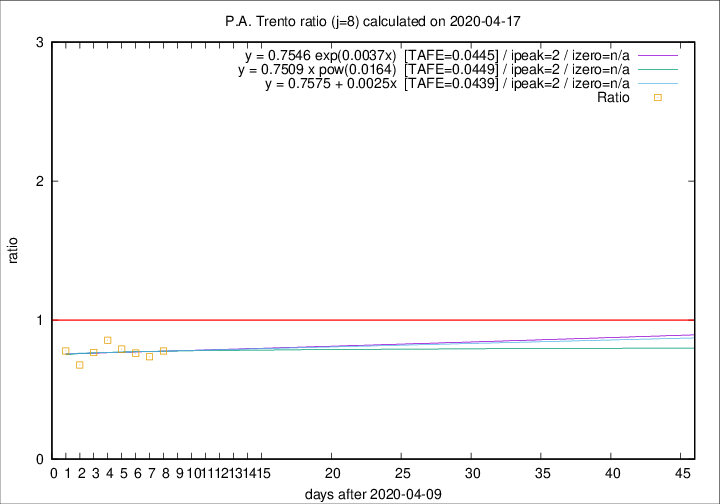

# P.A. Trento

Data source: https://raw.githubusercontent.com/pcm-dpc/COVID-19/master/dati-json/dpc-covid19-ita-regioni.json

Delta days analysis (j): 8

Analyses for other values of j for 2020-04-17 are avalable [here](../2020-04-17/README.md)

Analyses for P.A. Trento for previous dates are avalable [here](../README.md)

## Fitting 
|fit type|best fit equation|tafe|tfe|ipeak|izero|
|-------|-----|--------|------|---|---|
|linear|y = 0.7575 + 0.0025x  [TAFE=0.0439]|0.0439|0.0036|2|n/a|
|exp|y = 0.7546 exp(0.0037x)  [TAFE=0.0445]|0.0445|0.0017|2|n/a|
|pow|y = 0.7509 x pow(0.0164)  [TAFE=0.0449]|0.0449|0.0018|2|n/a|

## Data
|Date|Daily deaths|Cumulated deaths|Deaths in the last 8 days|Deaths in the 8 days before|ratio|
|----|----------|-----------|-------|--------------------|-----|
|2020-04-17|20|342|74|95|0.7789|
|2020-04-16|4|322|67|91|0.7363|
|2020-04-15|8|318|74|97|0.7629|
|2020-04-14|10|310|80|101|0.7921|
|2020-04-13|7|300|83|97|0.8557|
|2020-04-12|9|293|83|108|0.7685|
|2020-04-11|9|284|80|118|0.6780|
|2020-04-10|7|275|88|113|0.7788|

[Download data as CSV](COVID-19_p.a._trento_j8_2020-04-17.csv)

Generated April 19th, 2020 at 18:42:39 UTC+0200 with https://github.com/robianc/COVID-19
