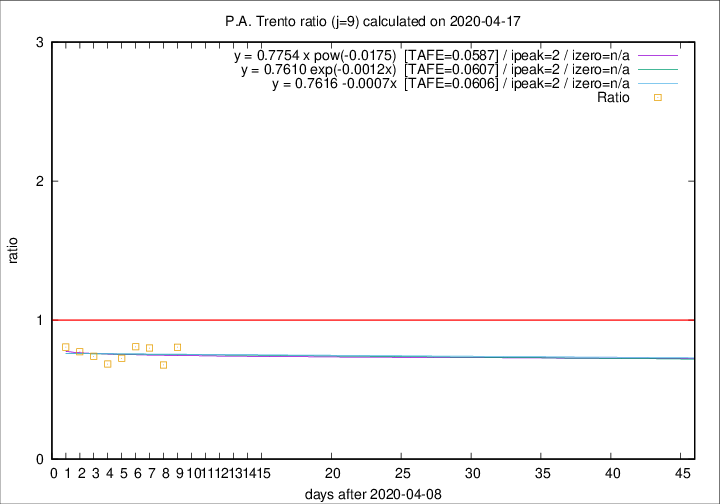

# P.A. Trento

Data source: https://raw.githubusercontent.com/pcm-dpc/COVID-19/master/dati-json/dpc-covid19-ita-regioni.json

Delta days analysis (j): 9

Analyses for other values of j for 2020-04-17 are avalable [here](../2020-04-17/README.md)

Analyses for P.A. Trento for previous dates are avalable [here](../README.md)

## Fitting 
|fit type|best fit equation|tafe|tfe|ipeak|izero|
|-------|-----|--------|------|---|---|
|linear|y = 0.7616 -0.0007x  [TAFE=0.0606]|0.0606|0.0045|2|n/a|
|exp|y = 0.7610 exp(-0.0012x)  [TAFE=0.0607]|0.0607|0.0024|2|n/a|
|pow|y = 0.7754 x pow(-0.0175)  [TAFE=0.0587]|0.0587|0.0021|2|n/a|

## Data
|Date|Daily deaths|Cumulated deaths|Deaths in the last 9 days|Deaths in the 9 days before|ratio|
|----|----------|-----------|-------|--------------------|-----|
|2020-04-17|20|342|87|108|0.8056|
|2020-04-16|4|322|78|115|0.6783|
|2020-04-15|8|318|88|110|0.8000|
|2020-04-14|10|310|93|115|0.8087|
|2020-04-13|7|300|90|124|0.7258|
|2020-04-12|9|293|89|130|0.6846|
|2020-04-11|9|284|97|131|0.7405|
|2020-04-10|7|275|102|132|0.7727|
|2020-04-09|13|268|104|129|0.8062|

[Download data as CSV](COVID-19_p.a._trento_j9_2020-04-17.csv)

Generated April 19th, 2020 at 18:42:39 UTC+0200 with https://github.com/robianc/COVID-19
