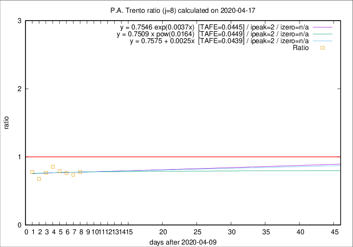

# P.A. Trento

Data source: https://raw.githubusercontent.com/pcm-dpc/COVID-19/master/dati-json/dpc-covid19-ita-regioni.json

Estimates in this page were made on 19/4/2020 with data available until 17/04/2020.

## Summary 

### Peak estimate 
|j|linear [TAFE]|exponential [TAFE]|power law [TAFE]|details|
|---|----|-----------|---------|-------|
|7|13/4/2020 [TAFE=0.0724]|13/4/2020 [TAFE=0.0725]|13/4/2020 [TAFE=0.0744]|[analysis](COVID-19_p.a._trento_j7_2020-04-17.md)|
|8|12/4/2020 [TAFE=0.0439]|12/4/2020 [TAFE=0.0445]|12/4/2020 [TAFE=0.0449]|[analysis](COVID-19_p.a._trento_j8_2020-04-17.md)|
|9|11/4/2020 [TAFE=0.0606]|11/4/2020 [TAFE=0.0607]|11/4/2020 [TAFE=0.0587]|[analysis](COVID-19_p.a._trento_j9_2020-04-17.md)|
|10|10/4/2020 [TAFE=0.0832]|10/4/2020 [TAFE=0.0782]|10/4/2020 [TAFE=0.0543]|[analysis](COVID-19_p.a._trento_j10_2020-04-17.md)|
|11|12/4/2020 [TAFE=0.1225]|12/4/2020 [TAFE=0.1050]|11/4/2020 [TAFE=0.0579]|[analysis](COVID-19_p.a._trento_j11_2020-04-17.md)|
|12|14/4/2020 [TAFE=0.1527]|13/4/2020 [TAFE=0.0967]|12/4/2020 [TAFE=0.0819]|[analysis](COVID-19_p.a._trento_j12_2020-04-17.md)|
|13|15/4/2020 [TAFE=0.2798]|15/4/2020 [TAFE=0.1036]|14/4/2020 [TAFE=0.0796]|[analysis](COVID-19_p.a._trento_j13_2020-04-17.md)|
|14|15/4/2020 [TAFE=0.3943]|15/4/2020 [TAFE=0.1064]|16/4/2020 [TAFE=0.1398]|[analysis](COVID-19_p.a._trento_j14_2020-04-17.md)|

Best estimator is linear with j=8 (TAFE=0.0439)
Corresponding peak date estimate is 12/4/2020 (ipeak 2)

Peak date range estimate: 12/4/2020 - 22/4/2020

### End estimate 
|j|linear [TAFE/TFE]|exponential [TAFE/TFE]|power law [TAFE/TFE]|details|
|---|----|-----------|---------|-------|
|7|-|-|-|[analysis](COVID-19_p.a._trento_j7_2020-04-17.md)|
|8|-|-|-|[analysis](COVID-19_p.a._trento_j8_2020-04-17.md)|
|9|-|-|-|[analysis](COVID-19_p.a._trento_j9_2020-04-17.md)|
|10|14/5/2020 [TAFE=0.0832]|-|-|[analysis](COVID-19_p.a._trento_j10_2020-04-17.md)|
|11|-|-|-|[analysis](COVID-19_p.a._trento_j11_2020-04-17.md)|
|12|-|-|-|[analysis](COVID-19_p.a._trento_j12_2020-04-17.md)|
|13|-|-|-|[analysis](COVID-19_p.a._trento_j13_2020-04-17.md)|
|14|-|-|-|[analysis](COVID-19_p.a._trento_j14_2020-04-17.md)|

Best estimator is linear with j=10 (TAFE=0.0832)
Corresponding end date estimate is 14/5/2020 (izero 36)

End date range estimate: 8/4/2020 - 14/5/2020

Generated April 19th, 2020 at 18:42:39 UTC+0200 with https://github.com/robianc/COVID-19
