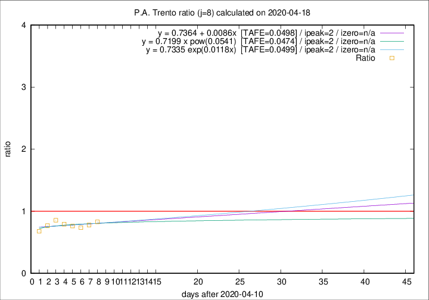
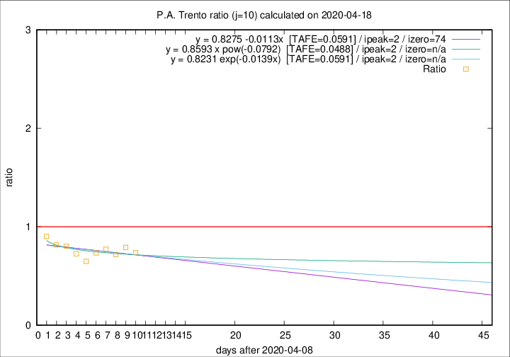

# P.A. Trento

Data source: https://raw.githubusercontent.com/pcm-dpc/COVID-19/master/dati-json/dpc-covid19-ita-regioni.json

Estimates in this page were made on 19/4/2020 with data available until 18/04/2020.

## Summary 

### Peak estimate 
|j|linear [TAFE]|exponential [TAFE]|power law [TAFE]|details|
|---|----|-----------|---------|-------|
|7|14/4/2020 [TAFE=0.0792]|14/4/2020 [TAFE=0.0804]|14/4/2020 [TAFE=0.0769]|[analysis](COVID-19_p.a._trento_j7_2020-04-18.md)|
|8|13/4/2020 [TAFE=0.0498]|13/4/2020 [TAFE=0.0499]|13/4/2020 [TAFE=0.0474]|[analysis](COVID-19_p.a._trento_j8_2020-04-18.md)|
|9|12/4/2020 [TAFE=0.0515]|12/4/2020 [TAFE=0.0515]|12/4/2020 [TAFE=0.0546]|[analysis](COVID-19_p.a._trento_j9_2020-04-18.md)|
|10|11/4/2020 [TAFE=0.0591]|11/4/2020 [TAFE=0.0591]|11/4/2020 [TAFE=0.0488]|[analysis](COVID-19_p.a._trento_j10_2020-04-18.md)|
|11|11/4/2020 [TAFE=0.1125]|10/4/2020 [TAFE=0.0989]|11/4/2020 [TAFE=0.0643]|[analysis](COVID-19_p.a._trento_j11_2020-04-18.md)|
|12|14/4/2020 [TAFE=0.1622]|14/4/2020 [TAFE=0.1196]|12/4/2020 [TAFE=0.0753]|[analysis](COVID-19_p.a._trento_j12_2020-04-18.md)|
|13|15/4/2020 [TAFE=0.2116]|15/4/2020 [TAFE=0.1156]|14/4/2020 [TAFE=0.0787]|[analysis](COVID-19_p.a._trento_j13_2020-04-18.md)|
|14|16/4/2020 [TAFE=0.3553]|16/4/2020 [TAFE=0.1209]|16/4/2020 [TAFE=0.1100]|[analysis](COVID-19_p.a._trento_j14_2020-04-18.md)|

Best estimator is pow with j=8 (TAFE=0.0474)
Corresponding peak date estimate is 13/4/2020 (ipeak 2)

Peak date range estimate: 13/4/2020 - 22/4/2020

### End estimate 
|j|linear [TAFE/TFE]|exponential [TAFE/TFE]|power law [TAFE/TFE]|details|
|---|----|-----------|---------|-------|
|7|-|-|-|[analysis](COVID-19_p.a._trento_j7_2020-04-18.md)|
|8|-|-|-|[analysis](COVID-19_p.a._trento_j8_2020-04-18.md)|
|9|-|-|-|[analysis](COVID-19_p.a._trento_j9_2020-04-18.md)|
|10|22/6/2020 [TAFE=0.0591]|-|-|[analysis](COVID-19_p.a._trento_j10_2020-04-18.md)|
|11|-|-|-|[analysis](COVID-19_p.a._trento_j11_2020-04-18.md)|
|12|-|-|-|[analysis](COVID-19_p.a._trento_j12_2020-04-18.md)|
|13|-|-|-|[analysis](COVID-19_p.a._trento_j13_2020-04-18.md)|
|14|-|-|-|[analysis](COVID-19_p.a._trento_j14_2020-04-18.md)|

Best estimator is linear with j=10 (TAFE=0.0591)
Corresponding end date estimate is 22/6/2020 (izero 74)

End date range estimate: 9/4/2020 - 22/6/2020

Generated April 19th, 2020 at 18:42:39 UTC+0200 with https://github.com/robianc/COVID-19
