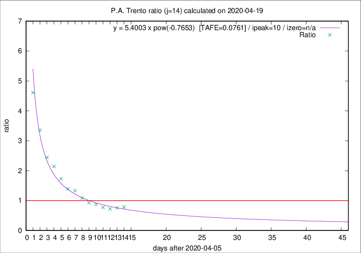

# P.A. Trento

Data source: https://raw.githubusercontent.com/pcm-dpc/COVID-19/master/dati-json/dpc-covid19-ita-regioni.json

Delta days analysis (j): 14

Analyses for other values of j for 2020-04-19 are avalable [here](../2020-04-19/README.md)

Analyses for P.A. Trento for previous dates are avalable [here](../README.md)

## Fitting 
|fit type|best fit equation|tafe|tfe|ipeak|izero|
|-------|-----|--------|------|---|---|
|pow|y = 5.4003 x pow(-0.7653)  [TAFE=0.0761]|0.0761|0.0039|10|n/a|

## Data
|Date|Daily deaths|Cumulated deaths|Deaths in the last 14 days|Deaths in the 14 days before|ratio|
|----|----------|-----------|-------|--------------------|-----|
|2020-04-19|12|360|143|182|0.7857|
|2020-04-18|6|348|138|182|0.7582|
|2020-04-17|20|342|138|191|0.7225|
|2020-04-16|4|322|135|175|0.7714|
|2020-04-15|8|318|145|166|0.8735|
|2020-04-14|10|310|146|157|0.9299|
|2020-04-13|7|300|153|141|1.0851|
|2020-04-12|9|293|164|123|1.3333|
|2020-04-11|9|284|164|118|1.3898|
|2020-04-10|7|275|173|100|1.7300|
|2020-04-09|13|268|182|85|2.1412|
|2020-04-08|11|255|181|74|2.4459|
|2020-04-07|14|244|188|56|3.3571|
|2020-04-06|13|230|189|41|4.6098|

[Download data as CSV](COVID-19_p.a._trento_j14_2020-04-19.csv)

Generated April 19th, 2020 at 18:42:39 UTC+0200 with https://github.com/robianc/COVID-19
