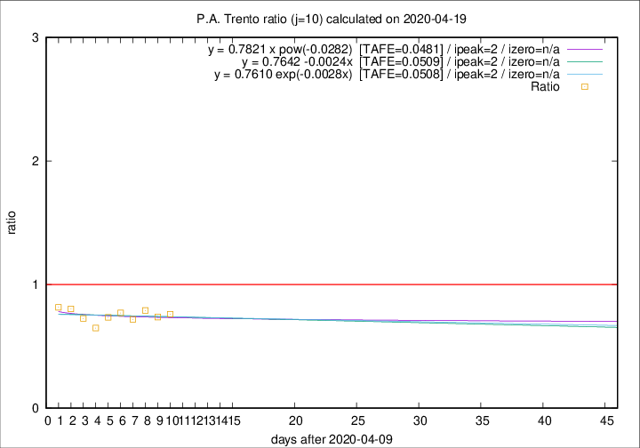
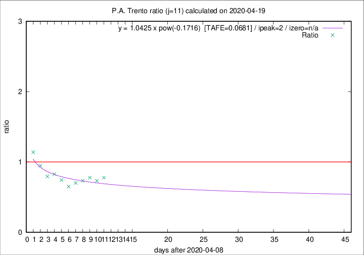

# P.A. Trento

Data source: https://raw.githubusercontent.com/pcm-dpc/COVID-19/master/dati-json/dpc-covid19-ita-regioni.json

Estimates in this page were made on 19/4/2020 with data available until 19/04/2020.

## Summary 

### Peak estimate 
|j|linear [TAFE]|exponential [TAFE]|power law [TAFE]|details|
|---|----|-----------|---------|-------|
|7|15/4/2020 [TAFE=0.0763]|15/4/2020 [TAFE=0.0777]|15/4/2020 [TAFE=0.0828]|[analysis](COVID-19_p.a._trento_j7_2020-04-19.md)|
|8|14/4/2020 [TAFE=0.0548]|14/4/2020 [TAFE=0.0532]|14/4/2020 [TAFE=0.0553]|[analysis](COVID-19_p.a._trento_j8_2020-04-19.md)|
|9|13/4/2020 [TAFE=0.0519]|13/4/2020 [TAFE=0.0520]|13/4/2020 [TAFE=0.0549]|[analysis](COVID-19_p.a._trento_j9_2020-04-19.md)|
|10|12/4/2020 [TAFE=0.0509]|12/4/2020 [TAFE=0.0508]|12/4/2020 [TAFE=0.0481]|[analysis](COVID-19_p.a._trento_j10_2020-04-19.md)|
|11|11/4/2020 [TAFE=0.1002]|11/4/2020 [TAFE=0.0929]|11/4/2020 [TAFE=0.0681]|[analysis](COVID-19_p.a._trento_j11_2020-04-19.md)|
|12|14/4/2020 [TAFE=0.1547]|13/4/2020 [TAFE=0.1287]|12/4/2020 [TAFE=0.0697]|[analysis](COVID-19_p.a._trento_j12_2020-04-19.md)|
|13|16/4/2020 [TAFE=0.1968]|15/4/2020 [TAFE=0.1265]|14/4/2020 [TAFE=0.0809]|[analysis](COVID-19_p.a._trento_j13_2020-04-19.md)|
|14|17/4/2020 [TAFE=0.3181]|16/4/2020 [TAFE=0.1364]|16/4/2020 [TAFE=0.0761]|[analysis](COVID-19_p.a._trento_j14_2020-04-19.md)|

Best estimator is pow with j=10 (TAFE=0.0481)
Corresponding peak date estimate is 12/4/2020 (ipeak 2)

Peak date range estimate: 12/4/2020 - 21/4/2020

### End estimate 
|j|linear [TAFE/TFE]|exponential [TAFE/TFE]|power law [TAFE/TFE]|details|
|---|----|-----------|---------|-------|
|7|-|-|-|[analysis](COVID-19_p.a._trento_j7_2020-04-19.md)|
|8|-|-|-|[analysis](COVID-19_p.a._trento_j8_2020-04-19.md)|
|9|-|-|-|[analysis](COVID-19_p.a._trento_j9_2020-04-19.md)|
|10|-|-|-|[analysis](COVID-19_p.a._trento_j10_2020-04-19.md)|
|11|15/5/2020 [TAFE=0.1002]|-|-|[analysis](COVID-19_p.a._trento_j11_2020-04-19.md)|
|12|-|-|-|[analysis](COVID-19_p.a._trento_j12_2020-04-19.md)|
|13|-|-|-|[analysis](COVID-19_p.a._trento_j13_2020-04-19.md)|
|14|-|-|-|[analysis](COVID-19_p.a._trento_j14_2020-04-19.md)|

Best estimator is linear with j=11 (TAFE=0.1002)
Corresponding end date estimate is 15/5/2020 (izero 36)

End date range estimate: 9/4/2020 - 15/5/2020

Generated April 19th, 2020 at 18:42:39 UTC+0200 with https://github.com/robianc/COVID-19
