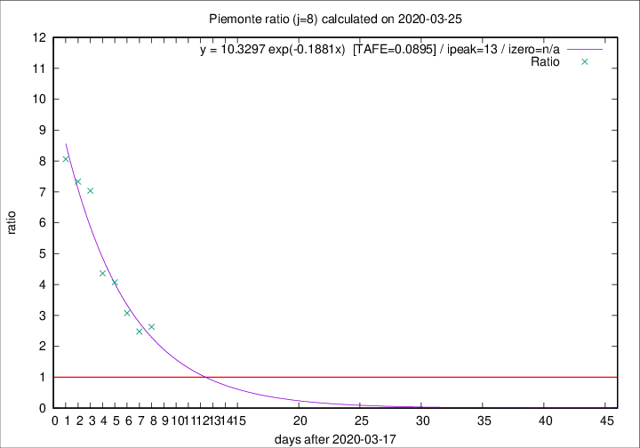

# Piemonte

Data source: https://raw.githubusercontent.com/pcm-dpc/COVID-19/master/dati-json/dpc-covid19-ita-regioni.json

Delta days analysis (j): 8

Analyses for other values of j for 2020-03-25 are avalable [here](../2020-03-25/README.md)

Analyses for Piemonte for previous dates are avalable [here](../README.md)

## Fitting 
|fit type|best fit equation|tafe|tfe|ipeak|izero|
|-------|-----|--------|------|---|---|
|exp|y = 10.3297 exp(-0.1881x)  [TAFE=0.0895]|0.0895|0.0052|13|n/a|

## Data
|Date|Daily deaths|Cumulated deaths|Deaths in the last 8 days|Deaths in the 8 days before|ratio|
|----|----------|-----------|-------|--------------------|-----|
|2020-03-25|75|449|316|120|2.6333|
|2020-03-24|59|374|263|106|2.4811|
|2020-03-23|32|315|234|76|3.0789|
|2020-03-22|45|283|224|55|4.0727|
|2020-03-21|29|238|192|44|4.3636|
|2020-03-20|34|209|183|26|7.0385|
|2020-03-19|21|175|154|21|7.3333|
|2020-03-18|21|154|137|17|8.0588|

[Download data as CSV](COVID-19_piemonte_j8_2020-03-25.csv)

Generated April 19th, 2020 at 18:42:39 UTC+0200 with https://github.com/robianc/COVID-19
