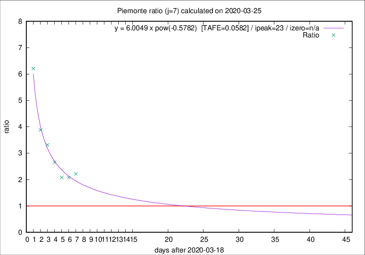
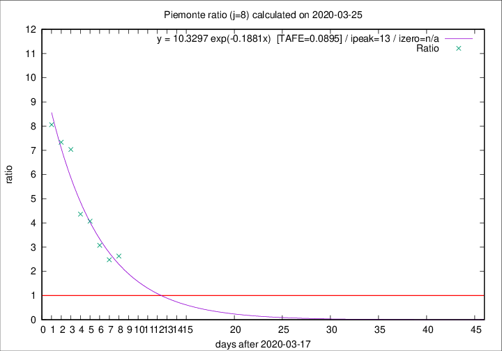

# Piemonte

Data source: https://raw.githubusercontent.com/pcm-dpc/COVID-19/master/dati-json/dpc-covid19-ita-regioni.json

Estimates in this page were made on 9/4/2020 with data available until 25/03/2020.

## Summary 

### Peak estimate 
|j|linear [TAFE]|exponential [TAFE]|power law [TAFE]|details|
|---|----|-----------|---------|-------|
|7|27/3/2020 [TAFE=0.1909]|30/3/2020 [TAFE=0.1250]|11/4/2020 [TAFE=0.0582]|[analysis](COVID-19_piemonte_j7_2020-03-25.md)|
|8|27/3/2020 [TAFE=0.1278]|31/3/2020 [TAFE=0.0895]|28/4/2020 [TAFE=0.1357]|[analysis](COVID-19_piemonte_j8_2020-03-25.md)|
|9|26/3/2020 [TAFE=0.3232]|31/3/2020 [TAFE=0.1344]|27/4/2020 [TAFE=0.1102]|[analysis](COVID-19_piemonte_j9_2020-03-25.md)|
|10|27/3/2020 [TAFE=0.2572]|2/4/2020 [TAFE=0.1327]|8/6/2020 [TAFE=0.2203]|[analysis](COVID-19_piemonte_j10_2020-03-25.md)|
|11|-|-|-||
|12|-|-|-||
|13|-|-|-||
|14|-|-|-||

Best estimator is pow with j=7 (TAFE=0.0582)
Corresponding peak date estimate is 11/4/2020 (ipeak 23)

Peak date range estimate: 19/3/2020 - 11/6/2020

### End estimate 
|j|linear [TAFE/TFE]|exponential [TAFE/TFE]|power law [TAFE/TFE]|details|
|---|----|-----------|---------|-------|
|7|29/3/2020 [TAFE=0.1909]|-|-|[analysis](COVID-19_piemonte_j7_2020-03-25.md)|
|8|29/3/2020 [TAFE=0.1278]|-|-|[analysis](COVID-19_piemonte_j8_2020-03-25.md)|
|9|-|-|-|[analysis](COVID-19_piemonte_j9_2020-03-25.md)|
|10|-|-|-|[analysis](COVID-19_piemonte_j10_2020-03-25.md)|
|11|-|-|-||
|12|-|-|-||
|13|-|-|-||
|14|-|-|-||

Best estimator is linear with j=8 (TAFE=0.1278)
Corresponding end date estimate is 29/3/2020 (izero 11)

End date range estimate: 18/3/2020 - 29/3/2020

Generated April 9th, 2020 at 16:40:48 UTC+0200 with https://github.com/robianc/COVID-19
