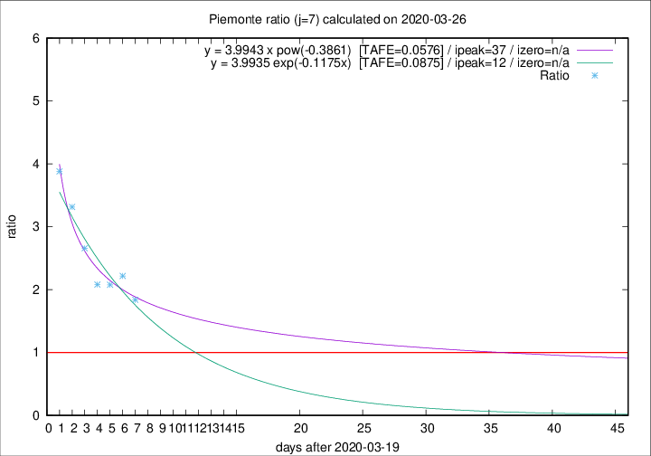

# Piemonte

Data source: https://raw.githubusercontent.com/pcm-dpc/COVID-19/master/dati-json/dpc-covid19-ita-regioni.json

Delta days analysis (j): 7

## Fitting 
|fit type|best fit equation|tafe|tfe|ipeak|izero|
|-------|-----|--------|------|---|---|
|exp|y = 3.9935 exp(-0.1175x)  [TAFE=0.0875]|0.0875|0.0049|12|n/a|
|pow|y = 3.9943 x pow(-0.3861)  [TAFE=0.0576]|0.0576|0.0025|37|n/a|

## Data
|Date|Daily deaths|Cumulated deaths|Deaths in the last 7 days|Deaths in the 7 days before|ratio|
|----|----------|-----------|-------|--------------------|-----|
|2020-03-26|0|449|274|149|1.8389|
|2020-03-25|75|449|295|133|2.2180|
|2020-03-24|59|374|241|116|2.0776|
|2020-03-23|32|315|204|98|2.0816|
|2020-03-22|45|283|202|76|2.6579|
|2020-03-21|29|238|179|54|3.3148|
|2020-03-20|34|209|163|42|3.8810|

[Download data as CSV](COVID-19_piemonte_j7_2020-03-26.csv)

Generated April 9th, 2020 at 16:40:48 UTC+0200 with https://github.com/robianc/COVID-19
