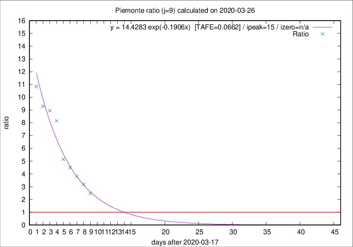

# Piemonte

Data source: https://raw.githubusercontent.com/pcm-dpc/COVID-19/master/dati-json/dpc-covid19-ita-regioni.json

Delta days analysis (j): 9

Analyses for other values of j for 2020-03-26 are avalable [here](../2020-03-26/README.md)

Analyses for Piemonte for previous dates are avalable [here](../README.md)

## Fitting 
|fit type|best fit equation|tafe|tfe|ipeak|izero|
|-------|-----|--------|------|---|---|
|exp|y = 14.4283 exp(-0.1906x)  [TAFE=0.0662]|0.0662|0.0037|15|n/a|

## Data
|Date|Daily deaths|Cumulated deaths|Deaths in the last 9 days|Deaths in the 9 days before|ratio|
|----|----------|-----------|-------|--------------------|-----|
|2020-03-26|0|449|316|128|2.4688|
|2020-03-25|75|449|338|106|3.1887|
|2020-03-24|59|374|293|77|3.8052|
|2020-03-23|32|315|256|57|4.4912|
|2020-03-22|45|283|237|46|5.1522|
|2020-03-21|29|238|212|26|8.1538|
|2020-03-20|34|209|188|21|8.9524|
|2020-03-19|21|175|158|17|9.2941|
|2020-03-18|21|154|141|13|10.8462|

[Download data as CSV](COVID-19_piemonte_j9_2020-03-26.csv)

Generated April 19th, 2020 at 18:42:39 UTC+0200 with https://github.com/robianc/COVID-19
