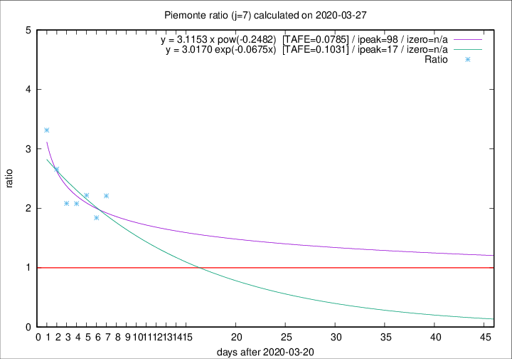

# Piemonte

Data source: https://raw.githubusercontent.com/pcm-dpc/COVID-19/master/dati-json/dpc-covid19-ita-regioni.json

Estimates in this page were made on 14/4/2020 with data available until 27/03/2020.

## Summary 

### Peak estimate 
|j|linear [TAFE]|exponential [TAFE]|power law [TAFE]|details|
|---|----|-----------|---------|-------|
|7|2/4/2020 [TAFE=0.1093]|7/4/2020 [TAFE=0.1031]|27/6/2020 [TAFE=0.0785]|[analysis](COVID-19_piemonte_j7_2020-03-27.md)|
|8|30/3/2020 [TAFE=0.1759]|2/4/2020 [TAFE=0.1243]|24/4/2020 [TAFE=0.0785]|[analysis](COVID-19_piemonte_j8_2020-03-27.md)|
|9|29/3/2020 [TAFE=0.1550]|2/4/2020 [TAFE=0.1046]|5/5/2020 [TAFE=0.1303]|[analysis](COVID-19_piemonte_j9_2020-03-27.md)|
|10|28/3/2020 [TAFE=0.3484]|2/4/2020 [TAFE=0.1499]|30/4/2020 [TAFE=0.1238]|[analysis](COVID-19_piemonte_j10_2020-03-27.md)|
|11|28/3/2020 [TAFE=0.2996]|4/4/2020 [TAFE=0.1198]|30/5/2020 [TAFE=0.2307]|[analysis](COVID-19_piemonte_j11_2020-03-27.md)|
|12|-|-|-||
|13|-|-|-||
|14|-|-|-||

Best estimator is pow with j=7 (TAFE=0.0785)
Corresponding peak date estimate is 27/6/2020 (ipeak 98)

Peak date range estimate: 21/3/2020 - 27/6/2020

### End estimate 
|j|linear [TAFE/TFE]|exponential [TAFE/TFE]|power law [TAFE/TFE]|details|
|---|----|-----------|---------|-------|
|7|8/4/2020 [TAFE=0.1093]|-|-|[analysis](COVID-19_piemonte_j7_2020-03-27.md)|
|8|-|-|-|[analysis](COVID-19_piemonte_j8_2020-03-27.md)|
|9|-|-|-|[analysis](COVID-19_piemonte_j9_2020-03-27.md)|
|10|-|-|-|[analysis](COVID-19_piemonte_j10_2020-03-27.md)|
|11|-|-|-|[analysis](COVID-19_piemonte_j11_2020-03-27.md)|
|12|-|-|-||
|13|-|-|-||
|14|-|-|-||

Best estimator is linear with j=7 (TAFE=0.1093)
Corresponding end date estimate is 8/4/2020 (izero 18)

End date range estimate: 21/3/2020 - 8/4/2020

Generated April 14th, 2020 at 19:16:04 UTC+0200 with https://github.com/robianc/COVID-19
