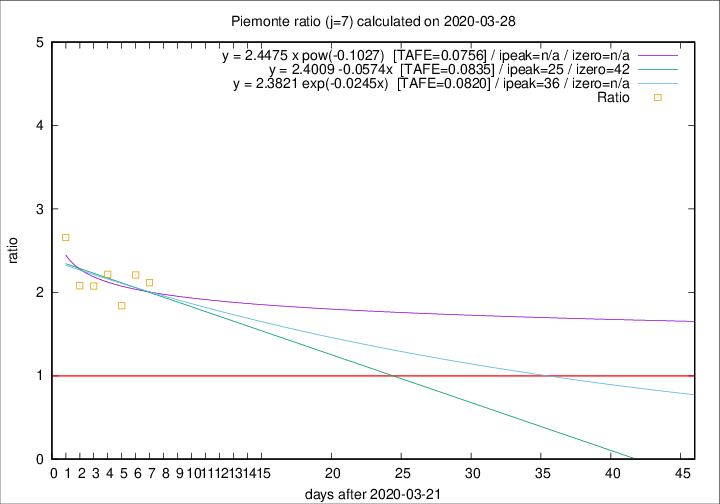

# Piemonte

Data source: https://raw.githubusercontent.com/pcm-dpc/COVID-19/master/dati-json/dpc-covid19-ita-regioni.json

Delta days analysis (j): 7

Analyses for other values of j for 2020-03-28 are avalable [here](../2020-03-28/README.md)

Analyses for Piemonte for previous dates are avalable [here](../README.md)

## Fitting 
|fit type|best fit equation|tafe|tfe|ipeak|izero|
|-------|-----|--------|------|---|---|
|linear|y = 2.4009 -0.0574x  [TAFE=0.0835]|0.0835|0.0081|25|42|
|exp|y = 2.3821 exp(-0.0245x)  [TAFE=0.0820]|0.0820|0.0040|36|n/a|
|pow|y = 2.4475 x pow(-0.1027)  [TAFE=0.0756]|0.0756|0.0031|n/a|n/a|

## Data
|Date|Daily deaths|Cumulated deaths|Deaths in the last 7 days|Deaths in the 7 days before|ratio|
|----|----------|-----------|-------|--------------------|-----|
|2020-03-28|48|617|379|179|2.1173|
|2020-03-27|120|569|360|163|2.2086|
|2020-03-26|0|449|274|149|1.8389|
|2020-03-25|75|449|295|133|2.2180|
|2020-03-24|59|374|241|116|2.0776|
|2020-03-23|32|315|204|98|2.0816|
|2020-03-22|45|283|202|76|2.6579|

[Download data as CSV](COVID-19_piemonte_j7_2020-03-28.csv)

Generated April 14th, 2020 at 19:16:04 UTC+0200 with https://github.com/robianc/COVID-19
