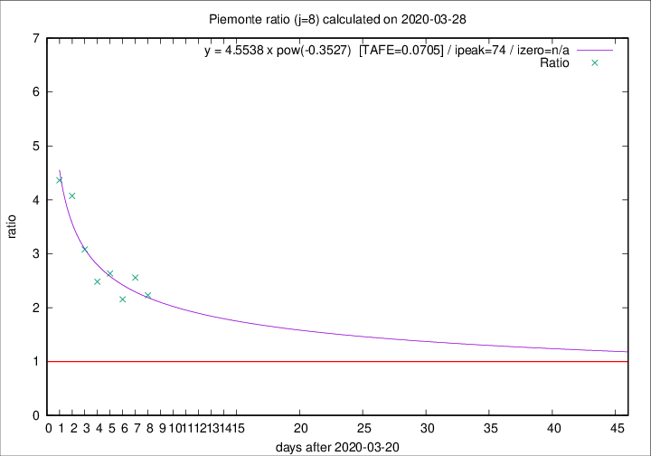
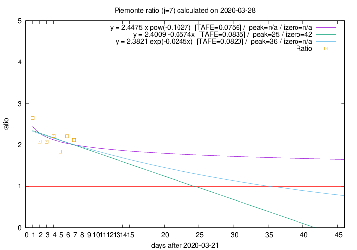

# Piemonte

Data source: https://raw.githubusercontent.com/pcm-dpc/COVID-19/master/dati-json/dpc-covid19-ita-regioni.json

Estimates in this page were made on 19/4/2020 with data available until 28/03/2020.

## Summary 

### Peak estimate 
|j|linear [TAFE]|exponential [TAFE]|power law [TAFE]|details|
|---|----|-----------|---------|-------|
|7|16/4/2020 [TAFE=0.0835]|27/4/2020 [TAFE=0.0820]|-|[analysis](COVID-19_piemonte_j7_2020-03-28.md)|
|8|2/4/2020 [TAFE=0.1299]|6/4/2020 [TAFE=0.1074]|3/6/2020 [TAFE=0.0705]|[analysis](COVID-19_piemonte_j8_2020-03-28.md)|
|9|30/3/2020 [TAFE=0.2280]|4/4/2020 [TAFE=0.1435]|1/5/2020 [TAFE=0.0871]|[analysis](COVID-19_piemonte_j9_2020-03-28.md)|
|10|30/3/2020 [TAFE=0.1693]|4/4/2020 [TAFE=0.0938]|21/5/2020 [TAFE=0.1655]|[analysis](COVID-19_piemonte_j10_2020-03-28.md)|
|11|29/3/2020 [TAFE=0.3574]|4/4/2020 [TAFE=0.1177]|13/5/2020 [TAFE=0.1956]|[analysis](COVID-19_piemonte_j11_2020-03-28.md)|
|12|-|-|-||
|13|-|-|-||
|14|-|-|-||

Best estimator is pow with j=8 (TAFE=0.0705)
Corresponding peak date estimate is 3/6/2020 (ipeak 74)

Peak date range estimate: 21/3/2020 - 3/6/2020

### End estimate 
|j|linear [TAFE/TFE]|exponential [TAFE/TFE]|power law [TAFE/TFE]|details|
|---|----|-----------|---------|-------|
|7|3/5/2020 [TAFE=0.0835]|-|-|[analysis](COVID-19_piemonte_j7_2020-03-28.md)|
|8|-|-|-|[analysis](COVID-19_piemonte_j8_2020-03-28.md)|
|9|-|-|-|[analysis](COVID-19_piemonte_j9_2020-03-28.md)|
|10|-|-|-|[analysis](COVID-19_piemonte_j10_2020-03-28.md)|
|11|-|-|-|[analysis](COVID-19_piemonte_j11_2020-03-28.md)|
|12|-|-|-||
|13|-|-|-||
|14|-|-|-||

Best estimator is linear with j=7 (TAFE=0.0835)
Corresponding end date estimate is 3/5/2020 (izero 42)

End date range estimate: 22/3/2020 - 3/5/2020

Generated April 19th, 2020 at 18:42:39 UTC+0200 with https://github.com/robianc/COVID-19
