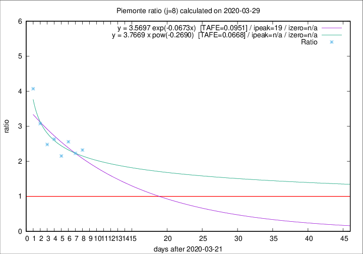

# Piemonte

Data source: https://raw.githubusercontent.com/pcm-dpc/COVID-19/master/dati-json/dpc-covid19-ita-regioni.json

Estimates in this page were made on 12/4/2020 with data available until 29/03/2020.

## Summary 

### Peak estimate 
|j|linear [TAFE]|exponential [TAFE]|power law [TAFE]|details|
|---|----|-----------|---------|-------|
|7|-|-|-|[analysis](COVID-19_piemonte_j7_2020-03-29.md)|
|8|4/4/2020 [TAFE=0.1119]|10/4/2020 [TAFE=0.0951]|-|[analysis](COVID-19_piemonte_j8_2020-03-29.md)|
|9|1/4/2020 [TAFE=0.2039]|5/4/2020 [TAFE=0.1321]|8/5/2020 [TAFE=0.0641]|[analysis](COVID-19_piemonte_j9_2020-03-29.md)|
|10|31/3/2020 [TAFE=0.2147]|5/4/2020 [TAFE=0.1157]|14/5/2020 [TAFE=0.1241]|[analysis](COVID-19_piemonte_j10_2020-03-29.md)|
|11|30/3/2020 [TAFE=0.3815]|5/4/2020 [TAFE=0.1328]|6/5/2020 [TAFE=0.1290]|[analysis](COVID-19_piemonte_j11_2020-03-29.md)|
|12|-|-|-||
|13|-|-|-||
|14|-|-|-||

Best estimator is pow with j=9 (TAFE=0.0641)
Corresponding peak date estimate is 8/5/2020 (ipeak 48)

Peak date range estimate: 21/3/2020 - 15/5/2020

### End estimate 
|j|linear [TAFE/TFE]|exponential [TAFE/TFE]|power law [TAFE/TFE]|details|
|---|----|-----------|---------|-------|
|7|-|-|-|[analysis](COVID-19_piemonte_j7_2020-03-29.md)|
|8|10/4/2020 [TAFE=0.1119]|-|-|[analysis](COVID-19_piemonte_j8_2020-03-29.md)|
|9|-|-|-|[analysis](COVID-19_piemonte_j9_2020-03-29.md)|
|10|-|-|-|[analysis](COVID-19_piemonte_j10_2020-03-29.md)|
|11|-|-|-|[analysis](COVID-19_piemonte_j11_2020-03-29.md)|
|12|-|-|-||
|13|-|-|-||
|14|-|-|-||

Best estimator is linear with j=8 (TAFE=0.1119)
Corresponding end date estimate is 10/4/2020 (izero 19)

End date range estimate: 22/3/2020 - 10/4/2020

Generated April 12th, 2020 at 17:02:01 UTC+0200 with https://github.com/robianc/COVID-19
