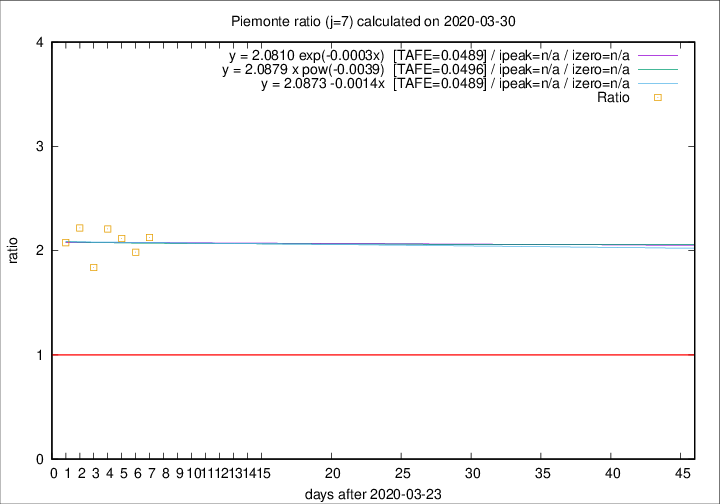

# Piemonte

Data source: https://raw.githubusercontent.com/pcm-dpc/COVID-19/master/dati-json/dpc-covid19-ita-regioni.json

Delta days analysis (j): 7

Analyses for other values of j for 2020-03-30 are avalable [here](../2020-03-30/README.md)

Analyses for Piemonte for previous dates are avalable [here](../README.md)

## Fitting 
|fit type|best fit equation|tafe|tfe|ipeak|izero|
|-------|-----|--------|------|---|---|
|linear|y = 2.0873 -0.0014x  [TAFE=0.0489]|0.0489|0.0036|n/a|n/a|
|exp|y = 2.0810 exp(-0.0003x)  [TAFE=0.0489]|0.0489|0.0021|n/a|n/a|
|pow|y = 2.0879 x pow(-0.0039)  [TAFE=0.0496]|0.0496|0.0018|n/a|n/a|

## Data
|Date|Daily deaths|Cumulated deaths|Deaths in the last 7 days|Deaths in the 7 days before|ratio|
|----|----------|-----------|-------|--------------------|-----|
|2020-03-30|65|749|434|204|2.1275|
|2020-03-29|67|684|401|202|1.9851|
|2020-03-28|48|617|379|179|2.1173|
|2020-03-27|120|569|360|163|2.2086|
|2020-03-26|0|449|274|149|1.8389|
|2020-03-25|75|449|295|133|2.2180|
|2020-03-24|59|374|241|116|2.0776|

[Download data as CSV](COVID-19_piemonte_j7_2020-03-30.csv)

Generated April 16th, 2020 at 20:09:19 UTC+0200 with https://github.com/robianc/COVID-19
