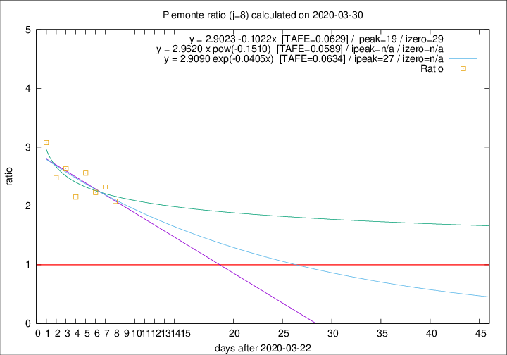

# Piemonte

Data source: https://raw.githubusercontent.com/pcm-dpc/COVID-19/master/dati-json/dpc-covid19-ita-regioni.json

Estimates in this page were made on 14/4/2020 with data available until 30/03/2020.

## Summary 

### Peak estimate 
|j|linear [TAFE]|exponential [TAFE]|power law [TAFE]|details|
|---|----|-----------|---------|-------|
|7|-|-|-|[analysis](COVID-19_piemonte_j7_2020-03-30.md)|
|8|11/4/2020 [TAFE=0.0629]|19/4/2020 [TAFE=0.0634]|-|[analysis](COVID-19_piemonte_j8_2020-03-30.md)|
|9|4/4/2020 [TAFE=0.1068]|9/4/2020 [TAFE=0.0827]|-|[analysis](COVID-19_piemonte_j9_2020-03-30.md)|
|10|1/4/2020 [TAFE=0.2374]|6/4/2020 [TAFE=0.1386]|11/5/2020 [TAFE=0.0884]|[analysis](COVID-19_piemonte_j10_2020-03-30.md)|
|11|1/4/2020 [TAFE=0.2007]|7/4/2020 [TAFE=0.0956]|27/5/2020 [TAFE=0.1607]|[analysis](COVID-19_piemonte_j11_2020-03-30.md)|
|12|31/3/2020 [TAFE=0.4207]|6/4/2020 [TAFE=0.1246]|16/5/2020 [TAFE=0.2027]|[analysis](COVID-19_piemonte_j12_2020-03-30.md)|
|13|-|-|-||
|14|-|-|-||

Best estimator is linear with j=8 (TAFE=0.0629)
Corresponding peak date estimate is 11/4/2020 (ipeak 19)

Peak date range estimate: 23/3/2020 - 30/5/2020

### End estimate 
|j|linear [TAFE/TFE]|exponential [TAFE/TFE]|power law [TAFE/TFE]|details|
|---|----|-----------|---------|-------|
|7|-|-|-|[analysis](COVID-19_piemonte_j7_2020-03-30.md)|
|8|21/4/2020 [TAFE=0.0629]|-|-|[analysis](COVID-19_piemonte_j8_2020-03-30.md)|
|9|-|-|-|[analysis](COVID-19_piemonte_j9_2020-03-30.md)|
|10|-|-|-|[analysis](COVID-19_piemonte_j10_2020-03-30.md)|
|11|-|-|-|[analysis](COVID-19_piemonte_j11_2020-03-30.md)|
|12|-|-|-|[analysis](COVID-19_piemonte_j12_2020-03-30.md)|
|13|-|-|-||
|14|-|-|-||

Best estimator is linear with j=8 (TAFE=0.0629)
Corresponding end date estimate is 21/4/2020 (izero 29)

End date range estimate: 23/3/2020 - 21/4/2020

Generated April 14th, 2020 at 19:16:04 UTC+0200 with https://github.com/robianc/COVID-19
